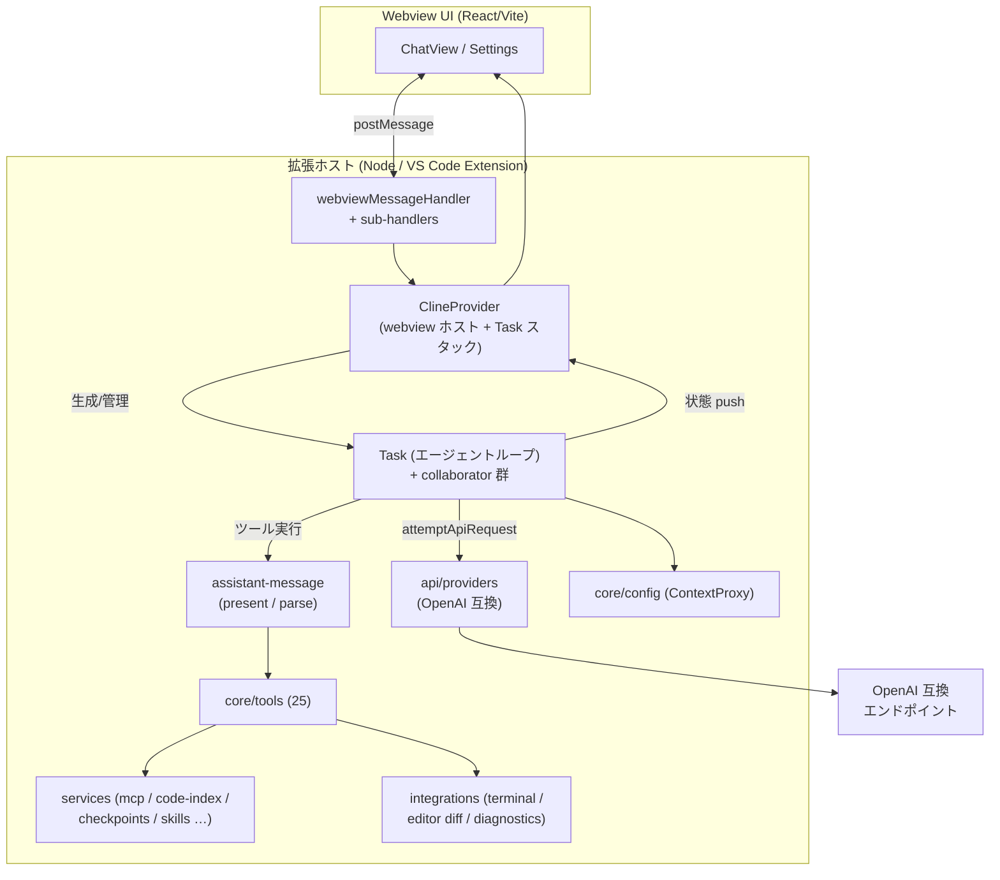
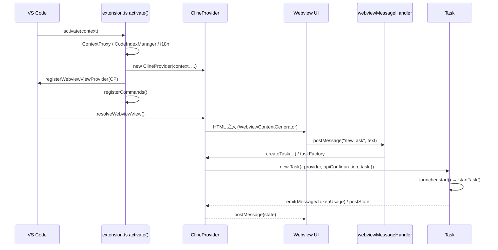
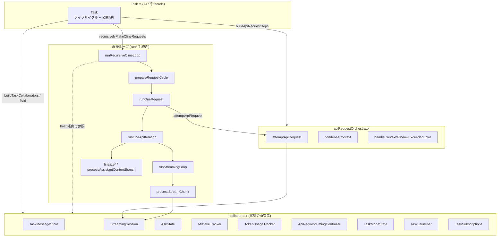

# アーキテクチャ概要

本書は **OpenAI Compatible Agent**（Roo Code を Apache 2.0 のもとで改変したフォーク）のソースを解析して得た内部仕様の地図である。現状（2026-08 時点）を反映し、**エージェント中核 `src/core/task/` を厚めに**記述している。

> 注意: コードから機械的に導出した概要であり、詳細・最新の挙動は必ずソースを参照。ファイル・関数・フラグ名は解析時点のもの。行数などの実測値は本文中に明記した時点の値。

---

## 1. 全体像

VS Code 拡張機能として動く AI コーディングエージェント。ユーザーのメッセージを受け取り、OpenAI 互換 LLM に問い合わせ、返ってきた「ツール呼び出し」を実行しながらタスクを進める。

- **プロバイダは OpenAI Compatible の 1 種類のみ**（Azure OpenAI を含む）。`buildApiHandler` は `openai` と、ネットワークを一切叩かないテスト用 `fake-ai` 以外を **例外で拒否**する（`src/api/index.ts`）。
- **UI 言語は日本語（既定）と英語のみ**。テレメトリなし。設定した LLM エンドポイント以外への外部通信を行わない。
- **CI は GitHub Actions を全廃**し、ローカルの `pnpm ci:local --strict` が唯一の品質ゲート（→ 13 章）。



**主な入口ファイル**: `src/extension.ts` / `src/core/webview/ClineProvider.ts` / `src/core/task/Task.ts`

---

## 2. モノレポ / ビルド構成

pnpm workspaces + turbo によるモノレポ。

| パッケージ                                     | 役割                                                                      |
| ---------------------------------------------- | ------------------------------------------------------------------------- |
| `src`（`openai-agent`）                        | VS Code 拡張本体。エージェントループ、ツール、Webview ホスト              |
| `webview-ui`（`@openai-agent/vscode-webview`） | React + Vite の Webview UI（チャット・設定）                              |
| `packages/types`（`@openai-agent/types`）      | 共有型（設定・イベント・モード・API スキーマ）。zod ベース                |
| `packages/core`（`@openai-agent/core`）        | プラットフォーム非依存のコア（task-history / worktree / custom-tools 等） |
| `packages/ipc`                                 | 拡張ホスト側のソケット IPC 実装（依存元は `src` のみ）                    |
| `packages/vscode-shim`                         | Node 環境で VS Code API を模倣する互換レイヤ                              |
| `packages/build`                               | esbuild ユーティリティ、`package.json` 生成                               |
| `apps/vscode-internal`                         | 拡張ビルド設定（`patchBranding` を含む）                                  |
| `apps/vscode-e2e`                              | 拡張を実起動して行う統合テスト                                            |

- 拡張本体は esbuild（`src/esbuild.mjs`）でバンドル。turbo タスクは `bundle` → `dist/**`、`test` は `types#build` と `openai-agent#bundle` に依存（`turbo.json`）。
- `src/workers/`（`countTokens.ts`）はトークン計測用の worker。
- 拡張 ID: `internal.openai-agent` / publisher: `internal`（内部ビルドは `internal.openai-compatible-agent`）。

**主な入口ファイル**: `turbo.json` / `package.json` / `src/esbuild.mjs` / `apps/vscode-internal/esbuild.mjs`

---

## 3. 拡張機能のライフサイクル

入口は `src/extension.ts` の `activate()`。

1. `.env`（任意）読込 → ネットワークプロキシ初期化 → 設定マイグレーション → i18n 初期化 → `TerminalRegistry.initialize()`。
2. `ContextProxy.getInstance(context)` で設定・シークレットを初期化。
3. ワークスペースごとに `CodeIndexManager` を生成し、**バックグラウンドで**コードインデックス構築（activation はブロックしない）。
4. `ClineProvider`（`src/core/webview/ClineProvider.ts`）を生成し、`registerWebviewViewProvider` でサイドバー Webview として登録。
5. 設定の自動インポート → `registerCommands()`（`src/activate/registerCommands.ts`）でコマンド登録 → diff 用の `TextDocumentContentProvider`・CodeActions・Terminal actions を登録。
6. 戻り値は `API`（`src/extension/api.ts`）。IPC ソケットが指定されていれば外部プロセスへイベントを中継。

`ClineProvider` は 990 行の facade で、責務の大半はサブシステムへ分割済み（`TaskStackController` / `ProviderProfileController` / `ModeController` / `TaskHistoryReader` / `CodeIndexStatusSubscriber` / `WebviewContentGenerator` 等、20 collaborator）。webview メッセージは `setWebviewMessageListener` → `webviewMessageHandler` へ 1 行委譲し、そこからドメイン別 sub-handler（`apiConfigMessageHandlers` / `mcpMessageHandlers` / `codeIndexMessageHandlers` / `fileEditorMessageHandlers` 等）へ振り分ける。

`Task` はスタックで管理され、`NewTaskTool` によるサブタスクで入れ子になる（親は `isPaused` で待機、子完了で resume）。



**主な入口ファイル**: `src/extension.ts` / `src/activate/registerCommands.ts` / `src/core/webview/ClineProvider.ts` / `src/core/webview/webviewMessageHandler.ts` / `src/extension/api.ts`

---

## 4. エージェント中核（Task）

`src/core/task/` は **79 の production モジュール（トップレベル）＋ 82 のテスト**で構成され、リポジトリで最も情報密度が高い領域。`Task.ts` はかつての god-object を分割し切った結果 **747 行の facade** となり、状態と手続きは collaborator 群・純関数モジュール群へ責務分散している（背景は `docs/god-object-refactor.md` / `docs/task-builder-plan.md`）。

### 4.1 Task の位置づけ

`Task` は `EventEmitter<TaskEvents>` を継承し `TaskLike` を実装する薄い調整役。役割は「**ライフサイクルと公開 API の窓口**」であり、実処理は次の 2 系統に委譲する。

- **collaborator（状態の所有者）**: `readonly foo = new Foo()` の class field、または `buildTaskCollaborators()` factory 経由で構築。テストは `TaskOptions.collaborators` に fake を注入でき、`vi.mock` を並べずに real Task を作れる（`src/core/task/TaskBuilder.ts`）。
- **`run*` / `finalize*` モジュール（手続き）**: `Task` の各メソッドは `runFoo({ host: this }, ...)` の形で単一関数へ委譲。関数側は Task 具象ではなく **narrow な host interface** だけを要求し、`core/task → 具象 Task` の import 辺を増やさない（循環ガード維持）。

構築時の分岐: `resolveTaskIdentity`（historyItem 優先で id/workspace を決める純関数）→ `validateTaskOptions`（引数検証）→ `buildTaskCollaborators` → `TaskModeState.fromHistoryItem | fromProvider` → `TaskLauncher`（起動元 fresh/history を 1 度だけ確定）。`startTask:true` なら `launcher.start()`。

### 4.2 collaborator 一覧

| collaborator                                         | 所有する状態 / 責務                                                                                                                                       | ファイル                        |
| ---------------------------------------------------- | --------------------------------------------------------------------------------------------------------------------------------------------------------- | ------------------------------- |
| `TaskMessageStore`                                   | 2 会話配列（`apiConversationHistory` / `clineMessages`）の保持と素のディスク I/O。参照側は `task.messageStore.clineMessages` で直接触る（proxy 撤去済み） | `TaskMessageStore.ts`           |
| `StreamingSession`                                   | 1 request 分の streaming 状態 17 field（buffers / lifecycle flags / per-turn tool flags / HTTP abort controller）                                         | `StreamingSession.ts`           |
| `AskState`                                           | webview への ask とその応答（`askResponse*` / `lastMessageTs` / `idle・resumable・interactiveAsk` / auto-approval timer）                                 | `AskState.ts`                   |
| `MistakeTracker`                                     | 連続ミス counter（`count`/`limit`）と apply_diff / edit_file の失敗回数 Map                                                                               | `MistakeTracker.ts`             |
| `TokenUsageTracker`                                  | token/tool usage 算出・スナップショットキャッシュ・debounce emit（throttle 相当、2s）                                                                     | `TokenUsageTracker.ts`          |
| `ApiRequestTimingController`                         | プロバイダのレート制限待ち・失敗時の指数バックオフ告知（`api_req_retry_delayed`）                                                                         | `ApiRequestTimingController.ts` |
| `GraceRetryCounter`                                  | 空応答リトライの猶予カウンタ                                                                                                                              | `GraceRetryCounter.ts`          |
| `MessageQueueService`                                | ストリーミング中に来たユーザー入力のキュー（`core/message-queue`）                                                                                        | —                               |
| `TaskModeState`                                      | mode / provider profile 名とその非同期初期化（`fromHistoryItem`/`fromProvider`）                                                                          | `TaskModeState.ts`              |
| `TaskLauncher`                                       | 起動元（fresh/history/none）と起動済みフラグ                                                                                                              | `TaskLauncher.ts`               |
| `TaskSubscriptions`                                  | 外部 emitter 購読（queue 状態変化 / provider profile 変化）の登録と一括解除                                                                               | `TaskSubscriptions.ts`          |
| `AutoApprovalHandler`                                | 自動承認の判定（`core/auto-approval`）                                                                                                                    | —                               |
| `FileContextTracker`                                 | エージェントが読んだ/編集したファイルの追跡（`core/context-tracking`）                                                                                    | —                               |
| `DiffViewProvider`                                   | 差分プレビュー適用（`integrations/editor`）                                                                                                               | —                               |
| `AgentIgnoreController` / `AgentProtectedController` | `.agentignore` / `.agentprotected` の判定                                                                                                                 | —                               |

補助: `MessageManager`（rewind 等の高レベル操作、lazy 生成）、`RepoPerTaskCheckpointService`（shadow git スナップショット）。

### 4.3 再帰リクエストループ

`Task.recursivelyMakeClineRequests()` → `runRecursiveClineLoop()` が中核。**明示的な `StackItem[]` スタック**を pop しながら回すループで（再帰呼び出しではなくスタック駆動）、1 周ごとに `runOneRequest` → `runOneApiIteration` → `runStreamingLoop` → `processStreamChunk` と降りていく。

各層の責務:

1. **`runRecursiveClineLoop`**（`runRecursiveClineLoop.ts`）: `while (stack.length > 0)`。abort チェック → `checkMistakeLimit`（越えたら ask、counter リセット）→ `prepareRequestCycle` → `runOneRequest`。`runOneRequest` の返り値 `action`（`break`/`abandoned`/`continue` + 任意の `nextStackItem`）でスタック操作を決める。catch に落ちたら `true` を返し `startTask` 側がタスク終了。
2. **`prepareRequestCycle`**（`prepareRequestCycle.ts`）: レート制限待ち → `stampLastGlobalApiRequestTime` → `prepareUserContentForRequest`（`api_req_started` placeholder 生成 + `@` mention 展開）→ `applySlashCommandModeSwitch` → `getEnvironmentDetails` → `persistUserMessageAndPlaceholder`（env_details 追記 + user message を API 履歴へ登録 + placeholder 更新）。返り値は `lastApiReqIndex`。
3. **`runOneRequest`**（`runOneRequest.ts`）: token accumulator 初期化 → `resetStreamingStateForNewApiRequest` → `cachedStreamingModel = api.getModel()` → `makeStreamClosures`（`updateApiReqMsg`/`abortStream`）→ `attemptApiRequest`（stream 取得）→ `runOneApiIteration`。
4. **`runOneApiIteration`**（`runOneApiIteration.ts`）: `stream.isStreaming=true` → try で `runStreamingLoop` → catch は `handleMidStreamError`（retry stack item / break / abandoned を返す）→ finally 相当で streaming state リセット → abort チェック → `finalizeStreamCompletion` → `processAssistantContentBranch`（次アクションを決定）。
5. **`runStreamingLoop`**（`runStreamingLoop.ts`）: iterator を `makeNextChunkWithAbort` で race-abort ラップし、chunk ごとに `processStreamChunk` で dispatch。1 chunk 後に `checkAbortOrInterruption`。ループ後に残 chunk の usage を回収する `drainStreamInBackground` を fire-and-forget 起動。
6. **`processStreamChunk`**（`processStreamChunk.ts`）: chunk 種別で振り分ける薄い dispatcher（`reasoning` / `text` / `usage`（tokens に加算）/ `grounding` / `tool_call_partial`（`NativeToolCallParser` で段階構築）/ `tool_call`（完成版 push））。

```mermaid
sequenceDiagram
    autonumber
    participant Loop as runRecursiveClineLoop
    participant Prep as prepareRequestCycle
    participant Orch as apiRequestOrchestrator<br/>(attemptApiRequest)
    participant One as runOneApiIteration
    participant SL as runStreamingLoop
    participant PC as processStreamChunk
    participant Present as presentAssistantMessage
    participant LLM as OpenAI 互換 API

    Loop->>Loop: abort? / checkMistakeLimit
    Loop->>Prep: レート制限→mention展開→env_details→user登録
    Prep-->>Loop: lastApiReqIndex
    Loop->>Orch: attemptApiRequest(retry)
    Orch->>Orch: manageContext / condense (必要時)
    Orch->>LLM: createMessage(system, history, tools)
    LLM-->>Orch: ApiStream
    Loop->>One: runOneRequest → runOneApiIteration(stream)
    One->>SL: runStreamingLoop
    loop 各 chunk
        SL->>PC: processStreamChunk(chunk)
        PC->>Present: text/tool_call を present (ツール実行)
        SL->>SL: checkAbortOrInterruption
    end
    SL-->>One: assistantMessage / reasoning
    One->>One: finalizeStreamCompletion
    One->>One: processAssistantContentBranch
    One-->>Loop: action (break / continue + nextStackItem)
    Loop->>Loop: stack 操作して次周へ
```

### 4.4 ストリーム処理とツール実行

streaming 中、`processStreamChunk` はテキスト/ツールを `StreamingSession.assistantMessageContent` に積みつつ `presentAssistantMessage`（`src/core/assistant-message/presentAssistantMessage.ts`）を呼ぶ。`presentAssistantMessage` は **再入ロック**（`presentAssistantMessageLocked` / `HasPendingUpdates`）で並行実行を防ぎ、content block を 1 つずつ処理する。

- テキストブロックは UI へ `say`。
- ツールブロックは `presentToolUse` → `toolDispatch`（`toolName → handler` の対応表。`savesCheckpoint` 列でチェックポイント要否を表現）→ 各 `*Tool`（25 種）。MCP は `presentMcpToolUse`。
- ツール実行前に自動承認（`core/auto-approval`）または `.agentignore` / `.agentprotected` の判定。ファイル編集は `DiffViewProvider` で差分プレビューを挟む。
- ツール結果は `pushToolResultToUserContent`（重複 `tool_use_id` を弾き API 400 を防止）で `userMessageContent` に積まれ、次リクエストのユーザーメッセージになる。
- `attempt_completion` でタスク完了、`new_task` でサブタスク delegation（親は tool_result を `flushPendingToolResultsToHistory` で永続化してから待機）。

**主な入口ファイル**: `src/core/assistant-message/presentAssistantMessage.ts` / `src/core/assistant-message/toolDispatch.ts` / `src/core/assistant-message/NativeToolCallParser.ts`

### 4.5 ask / message フロー

`Task.ask()` → `runAskFlow()`（`runAskFlow.ts`）が 4 パートで合成:

1. abort ガード → `upsertAskMessage` で `clineMessages` に追加/更新。
2. `checkAutoApproval` + `applyAutoApprovalDecision`（承認/タイムアウト）。
3. blocking かつ queue 空なら `scheduleAskStatusMutation`（idle/resumable/interactive の TaskStatus 遷移を確定 + `interactionRequired` を webview へ）、そうでなく queue に溜まっていれば `drainQueuedMessageForAsk`。
4. `awaitAskResponseAndFinalize`（`pWaitFor` で応答待ち → cleanup → return）。

webview からの応答は `handleWebviewAskResponse` → `AskState` に格納され、待機中の `pWaitFor` が解ける。ストリーミング中に届いたユーザー入力は `MessageQueueService` にキューされ、区切りで `processQueuedMessages` が dequeue して `submitUserMessage` する。

### 4.6 API リクエストオーケストレーション

`apiRequestOrchestrator.ts`（約 780 行）が「API リクエストサイクル」の 3 メソッドを集約。3 つとも同一の `ApiRequestOrchestratorDeps` を受ける（`Task.buildApiRequestDeps()` が組み立て）。

- **`attemptApiRequest`**: provider 設定を読み → `willManageContext`/`manageContext`（`core/context-management`）で必要なら要約/切り詰め → `buildTools`（ツール定義）+ system prompt 付きで `api.createMessage` → `ApiStream` を yield（最初の chunk が成功したときだけ yield、失敗時はユーザーにリトライさせる）。
- **`condenseContext`**: ユーザー起点の圧縮。tool_result を flush → `summarizeConversation`（`core/condense`）で履歴を要約置換 → `condense_context` say で UI 反映。失敗しても元履歴は保持しタスク続行。
- **`handleContextWindowExceededError`**: context window 超過時に `FORCED_CONTEXT_REDUCTION_PERCENT`(75) で強制縮小、`MAX_CONTEXT_WINDOW_RETRIES`(3) までリトライ。

`getEnvironmentDetails` / `buildNativeToolsArrayWithRestrictions` は fat な受け口を持つため、このモジュールからは**直接 import せず** deps 経由の関数（`getEnvironmentDetails` / `buildTools`）で受ける。これが循環ガードを保ちつつ Task 側に依存を閉じ込める鍵。

### 4.7 永続化・チェックポイント・イベント

- **会話履歴**: `TaskMessageStore` が `apiConversationHistory`（API 用）と `clineMessages`（UI 用）を保持し、`core/task-persistence` の `save/readApiMessages` / `save/readTaskMessages` でディスク I/O。`resumeTaskFromHistory`（`resumeTaskFromHistory.ts`）が再開時に両配列を復元し、中断した tool_use に対する tool_result 欠落を補完する。
- **チェックポイント**: `services/checkpoints` の shadow git（`RepoPerTaskCheckpointService`）。`checkpointSave/Restore/Diff` は Task から `core/checkpoints` に委譲。
- **イベント**: 各段階は `AgentEventName`（`Message` / `TaskTokenUsageUpdated` / `TaskToolFailed` 等）として emit され、`src/extension/api.ts` の `API` が集約して IPC へ中継。

### 4.8 core/task モジュールマップ



**主な入口ファイル**: `src/core/task/Task.ts` / `src/core/task/runRecursiveClineLoop.ts` / `src/core/task/runOneRequest.ts` / `src/core/task/runOneApiIteration.ts` / `src/core/task/runStreamingLoop.ts` / `src/core/task/apiRequestOrchestrator.ts` / `src/core/task/runAskFlow.ts` / `src/core/task/TaskBuilder.ts`

---

## 5. モード / システムプロンプト

エージェントは「モード」で振る舞いを切り替える。各モードは `packages/types/src/mode.ts` の `DEFAULT_MODES` に定義され、次の 4 要素を持つ。

- **`roleDefinition`** — LLM に与える役割・人格。システムプロンプト冒頭へ注入される。
- **`whenToUse`** — そのモードを選ぶべき場面。orchestrator が委譲先を決める判断材料にもなる。
- **`groups`** — 使えるツールの権限（`read` / `edit` / `command` / `mcp`）。`edit` は `fileRegex` で対象ファイルを絞れる。
- **`customInstructions`** — そのモード固有の手順。roleDefinition と併せてシステムプロンプトへ入る。

モード間の受け渡しは `switch_mode`（ユーザーに切替を要求）または `new_task`（サブタスクを別モードで起動）。現在のモードの roleDefinition・customInstructions・許可ツール一覧は `buildSystemPrompt`（`src/core/task/buildSystemPrompt.ts`）→ `src/core/prompts/system.ts` が組み立ててシステムプロンプトにする。

### 組み込みモード

- **🏗️ architect（計画）** — 実装はしない。まず情報収集とユーザーへの確認質問でタスクを理解し、`update_todo_list` で「別モードが単独で実行できる」粒度の todo リストに落とす。ユーザーの承認を得てから `switch_mode` で実装モードへ委譲する。必要なら Mermaid 図で設計を示す。**工数（時間）の見積もりは出さない**方針。編集権限は **`.md` のみ**（`fileRegex: "\.md$"`）で、計画中に誤ってコードを書き換えないためのガードになっている。
- **💻 code（実装）** — 汎用の実装モード。任意の言語・フレームワークでコードの記述・修正・リファクタ・新規作成を行う。read / edit / command / mcp を全て使える。
- **❓ ask（説明）** — コードや概念を解説・回答するが**変更はしない**（edit / command 権限が無く read / mcp のみ）。
- **🪲 debug（診断）** — 系統的に仮説を立てて原因を絞り込んでから直す、問題診断向けのモード。read / edit / command / mcp。
- **🪃 orchestrator（統括）** — 複雑なタスクを分割し、各サブタスクを `new_task` で最適なモードへ委譲・統括する。自分では実装しない。

**カスタムモード** はプロジェクトルートの `.agentmodes`（YAML/JSON）で定義でき、`groups` でツール権限を制御する。モード固有ルールは `.agent/rules-<slug>/` に置く。

**主な入口ファイル**: `packages/types/src/mode.ts` / `src/core/prompts/system.ts` / `src/core/task/buildSystemPrompt.ts`

---

## 6. ツール

LLM は「ツール呼び出し」でしか外界に作用できない。`src/core/tools/` には約 25 のツール（＋基盤の `BaseTool`・反復検出 `ToolRepetitionDetector`・使用可否検証 `validateToolUse`）があり、**どれを使えるかはモードの `groups` で決まる**。エージェントが実際にできることは大きく次の 5 系統。

- **ファイルを読み書きする** — `read_file`（読取）/ `list_files`（一覧）/ `write_to_file`（新規作成・全書換）/ `apply_diff`・`apply_patch`（既存ファイルを差分で編集）/ `search_and_replace`（検索置換）/ `edit_file`。編集系は `DiffViewProvider` で差分プレビューを挟み、`.agentignore` / `.agentprotected` で対象外・保護ファイルを弾く。
- **コードを探す** — `search_files`（ripgrep による正規表現の全文検索）/ `codebase_search`（コードインデックスを使った意味ベースの検索）。
- **コマンドを実行する** — `execute_command`（ワークスペースでシェル実行）/ `read_command_output`（実行中コマンドの追加出力を取得）。
- **タスクを進める・区切る** — `attempt_completion`（タスク完了を報告）/ `ask_followup_question`（ユーザーへ質問）/ `switch_mode`（モード切替）/ `new_task`（サブタスクを別モードで起動）/ `update_todo_list`（todo の管理）。
- **外部機能を呼ぶ** — `use_mcp_tool`・`access_mcp_resource`（MCP サーバのツール／リソース）/ `run_slash_command`（スラッシュコマンド）/ `skill`（スキル呼び出し）。

ツールの実行入口は `toolDispatch`（4.4 参照）で `toolName → handler` に振り分ける。LLM のネイティブ関数呼び出し（OpenAI 形式）は streaming 中に `NativeToolCallParser` が `ToolUse` へ組み立てる。

**主な入口ファイル**: `src/core/tools/` / `src/core/assistant-message/toolDispatch.ts`

---

## 7. プロバイダ（LLM 接続）

**このフォークで有効なのは OpenAI Compatible のみ**。実ファイルは（旧 doc の `openai-compatible.ts` から改名され）現在は次の構成:

- `src/api/index.ts` の `buildApiHandler` が `apiProvider` で分岐し、`openai` → `OpenAiHandler`、`fake-ai` → `FakeAIHandler`。それ以外は明示的に **throw**（migrate/import された外部プロバイダ設定でもエンドポイントを叩けない安全網）。
- `src/api/providers/openai.ts`（`OpenAiHandler`、`BaseProvider` を継承）が任意の OpenAI 互換エンドポイントと Azure OpenAI（Azure AI Inference 経路含む）をカバー。カスタムヘッダーは `openAiHeaders` で付与。
- `src/api/providers/index.ts` は `OpenAiHandler` / `FakeAIHandler` のみを re-export（他社プロバイダ handler はネットワーク egress 削減のため撤去済み）。
- 共通 HTTP ヘッダーは `src/api/providers/constants.ts` の `DEFAULT_HEADERS`（`User-Agent` のみ）。
- ストリーム正規化は `src/api/transform/`（`stream.ts` の `ApiStreamChunk`、`image-cleaning` / `model-params` / `reasoning`）。会話履歴 → プロバイダ形式の変換は `src/core/task/buildCleanConversationHistory.ts` と `OpenAiHandler` 内に集約。

**主な入口ファイル**: `src/api/index.ts` / `src/api/providers/openai.ts` / `src/api/providers/base-provider.ts` / `src/api/providers/constants.ts`

---

## 8. サービス層（`src/services/`）

| サービス                                      | 役割                                                                                                      |
| --------------------------------------------- | --------------------------------------------------------------------------------------------------------- |
| `mcp`                                         | Model Context Protocol サーバー接続。設定は `.agent/mcp.json` 等。`McpServerManager` を activation で管理 |
| `code-index`                                  | コードのベクトルインデックス（Qdrant 等）と埋め込み。`CodebaseSearchTool` の基盤。`CodeIndexManager`      |
| `checkpoints`                                 | shadow git による作業スナップショット（`RepoPerTaskCheckpointService`）                                   |
| `skills`                                      | スキル（`SKILL.md`）探索。`.agent/skills` が `.agents/skills` より優先                                    |
| `command`                                     | スラッシュコマンド・組み込みコマンド                                                                      |
| `agent-config`                                | `.agent` ディレクトリ探索（グローバル/プロジェクト/サブフォルダ）                                         |
| `glob` / `search` / `ripgrep` / `tree-sitter` | ファイル列挙・全文検索・構文解析                                                                          |

**主な入口ファイル**: `src/services/mcp/McpServerManager.ts` / `src/services/code-index/manager.ts`

---

## 9. 統合層（`src/integrations/`）

- `terminal`: シェル実行の抽象化（`AgentTerminal*` / `TerminalRegistry`）。VS Code ターミナル統合と実行結果の取り込み。
- `editor`: `DiffViewProvider` による差分表示・装飾。diff は `DIFF_VIEW_URI_SCHEME` の仮想ドキュメントで左側（読み取り専用）を提供。
- `diagnostics`: 言語サーバー診断の取り込み。
- `workspace` / `misc` / `theme`: ワークスペース情報、ファイルオープン、テーマ連携。

**主な入口ファイル**: `src/integrations/editor/DiffViewProvider.ts` / `src/integrations/terminal/TerminalRegistry.ts`

---

## 10. 設定・ファイル規約

| パス                                 | 用途                                                                     |
| ------------------------------------ | ------------------------------------------------------------------------ |
| `.agent/`                            | ルール・コマンド・MCP 設定・スキルを格納するプロジェクト設定ディレクトリ |
| `.agentmodes`                        | カスタムモード定義                                                       |
| `.agentrules` / `.agentrules-<mode>` | ルールファイル（レガシー `.clinerules` も併読）                          |
| `.agentignore`                       | エージェントのアクセス対象外指定（`AgentIgnoreController`）              |
| `.agentprotected`                    | 保護パターンの一覧に名前だけある未実装枠（判定は決め打ちパターンのみ）   |

設定・シークレットの中央窓口は `ContextProxy`（`src/core/config/ContextProxy.ts`）。プロバイダプロファイルは `ProviderSettingsManager`、カスタムモードは `CustomModesManager`。保護パターンは `AgentProtectedController` の `PROTECTED_PATTERNS`（`.agentignore` / `.agentmodes` / `.agentrules*` / `.agent/**` / `.vscode/**` / `AGENTS.md` 等）。

**主な入口ファイル**: `src/core/config/ContextProxy.ts` / `src/core/protect/AgentProtectedController.ts` / `src/core/ignore/AgentIgnoreController.ts`

---

## 11. Webview UI（`webview-ui/`）

React + Vite。拡張ホストとは `postMessage` で通信。

- 主要画面: チャット（`src/components/chat/`）、設定（`src/components/settings/`）。
- 設定のプロバイダ UI は OpenAI Compatible のみ。
- 入力は `cachedState`（ローカルバッファ）にバインドし「保存」で `ContextProxy` に反映。
- 内部エイリアス `@agent/*` は拡張側 `src/shared/*` を指す。ビルドは Vite。

**主な入口ファイル**: `webview-ui/src/App.tsx` / `webview-ui/src/components/`

---

## 12. 国際化（i18n）

- 拡張側: `src/i18n/locales/{ja,en}`、マニフェスト用 `src/package.nls.json`（既定=英語）と `src/package.nls.ja.json`。
- Webview 側: `webview-ui/src/i18n/locales/{ja,en}`。
- 対応言語は日本語・英語のみ（`src/shared/language.ts` の `LANGUAGES`）。

**主な入口ファイル**: `src/i18n/` / `webview-ui/src/i18n/`

---

## 13. ビルド・CI・パッケージング

### ローカル開発ループ

VS Code でリポジトリを開き **F5（`Run Extension`）** で拡張を起動する。`.vscode/launch.json` の `preLaunchTask`（`watch`）が拡張バンドル・Webview の Vite HMR・tsc をまとめて watch し、別ウィンドウ（Extension Development Host、`--extensionDevelopmentPath=src`）に拡張が読み込まれる。

- **拡張ホスト側**のコードを変えたら Development Host ウィンドウを**リロード**（`Developer: Reload Window`）して反映。
- **Webview UI は Vite HMR** で即反映（`webview-ui` の `dev`）。UI だけの調整はリロード不要。
- **テスト単体実行**: `pnpm --filter openai-agent exec vitest run <src 相対パス>`（Webview 側は `webview-ui` で `vitest run`）。
- 上げる前に **`pnpm ci:local --strict`** で全ゲートを通す（`--fast` で unit test をスキップし素早く確認）。

**主な入口ファイル**: `.vscode/launch.json` / `.vscode/tasks.json`（`watch` / `watch:webview` / `watch:bundle` / `watch:tsc`）

### ビルド・パッケージング

```bash
pnpm install
pnpm build                      # turbo で全パッケージをビルド
pnpm --filter openai-agent vsix # .vsix を生成
```

- 拡張本体は esbuild（`src/esbuild.mjs`）でバンドル。`apps/vscode-internal/esbuild.mjs` の `patchBranding()` が成果物中の文字列を新ブランドへ機械置換する安全網。
- **GitHub Actions は 2026-07-26 に全廃**（private repo の Actions 課金対策）。品質ゲートは `pnpm ci:local`（`scripts/ci-local.sh`）が唯一。検査内容は **i18n / knip / prettier / eslint / tsc / 循環依存 / unit test**。`--strict` で lockfile 検証 + turbo キャッシュ無視（CI 等価に寄せる）、`--fast` で unit test スキップ。
- **循環依存ガード**: `scripts/check-circular-deps.mjs`（madge/SCC ベース）が新規サイクルを拒否。baseline は `scripts/circular-deps-baseline.json`。god-object 分割で辺数 143→0 を達成・維持。
- セキュリティ用 lint（`eslint.security.config.mjs`）と `pnpm audit` ゼロ維持（別途手動）。

**主な入口ファイル**: `scripts/ci-local.sh` / `scripts/check-circular-deps.mjs` / `src/esbuild.mjs`

---

## 関連ドキュメント

サブシステム詳細:

- `docs/mcp.md` — MCP（Model Context Protocol）連携。接続ライフサイクル・差分計算・モデルへのツール露出・呼び出し経路。
- `docs/diff-and-checkpoints.md` — ファイル編集の差分プレビューと shadow git チェックポイント。diff 戦略・保護（`.agentignore`/`.agentprotected`）も。
- `docs/webview.md` — 拡張ホスト ↔ React UI のメッセージプロトコル・状態フロー・ClineProvider の collaborator 分割。

設計背景:

- `docs/god-object-refactor.md` — `ClineProvider` / `Task` / `webviewMessageHandler` の god-object 分割の設計方針・実測・技法（getter/setter プロキシ / 狭い interface / 純関数＋小クラス / フェーズ表判定）。
- `docs/task-builder-plan.md` — `Task` constructor 47 依存の分解計画。`buildTaskCollaborators` / collaborator 注入 / proxy 撤去（Phase 5a–5c）の実装記録。
- `AGENTS.md` — リポジトリ運用規約（Settings View パターン等）。
- 開発者ローカルの自動メモリ（リポジトリ外）に、god-object 分割・ローカル CI・循環ガードの経緯を記録。

---

## 付録: 主要な入口ファイル

| 関心事                    | ファイル                                                                    |
| ------------------------- | --------------------------------------------------------------------------- |
| 拡張の起動                | `src/extension.ts`                                                          |
| Webview ホスト            | `src/core/webview/ClineProvider.ts`                                         |
| Webview メッセージ処理    | `src/core/webview/webviewMessageHandler.ts`                                 |
| エージェントループ facade | `src/core/task/Task.ts`                                                     |
| 再帰リクエストループ      | `src/core/task/runRecursiveClineLoop.ts`                                    |
| API オーケストレーション  | `src/core/task/apiRequestOrchestrator.ts`                                   |
| ストリーム処理            | `src/core/task/runStreamingLoop.ts` / `processStreamChunk.ts`               |
| ツール実行                | `src/core/assistant-message/presentAssistantMessage.ts` / `toolDispatch.ts` |
| プロバイダ                | `src/api/index.ts` / `src/api/providers/openai.ts`                          |
| モード定義                | `packages/types/src/mode.ts`                                                |
| 外部 API/イベント         | `src/extension/api.ts` / `packages/types/src/events.ts`                     |
| ローカル CI               | `scripts/ci-local.sh`                                                       |
