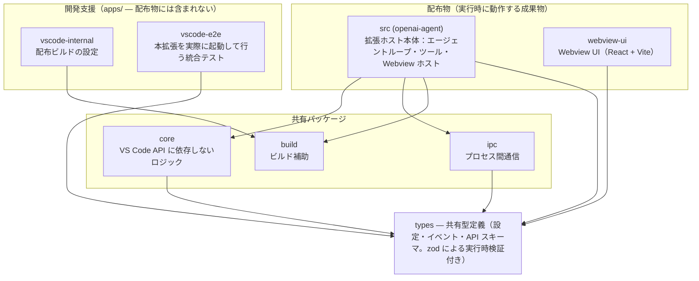
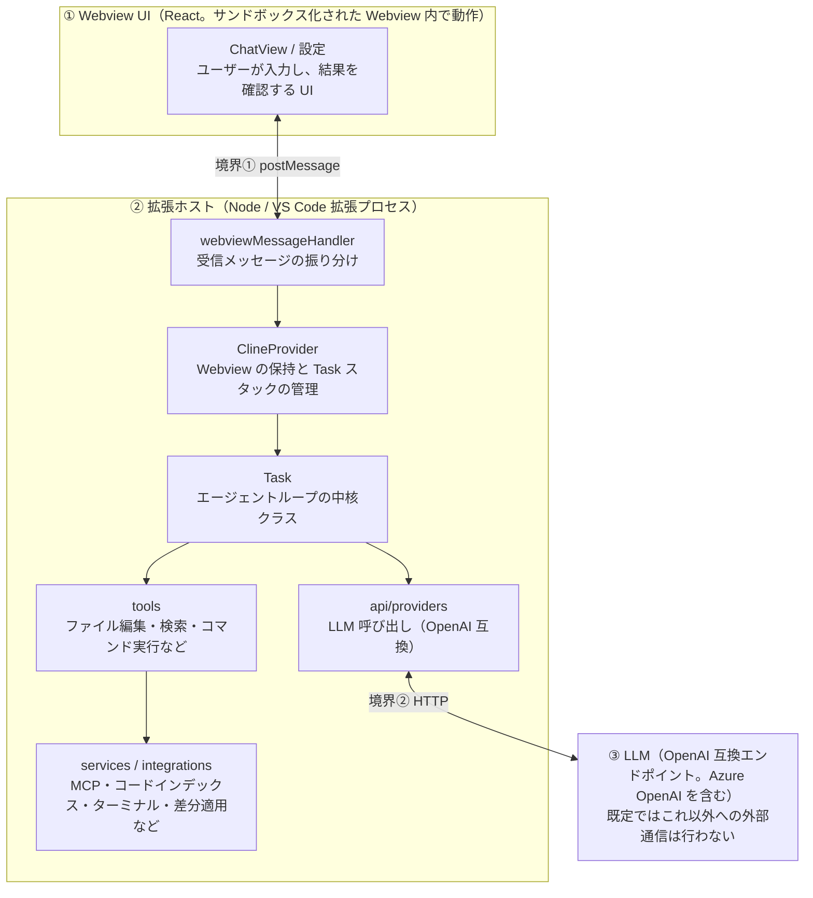
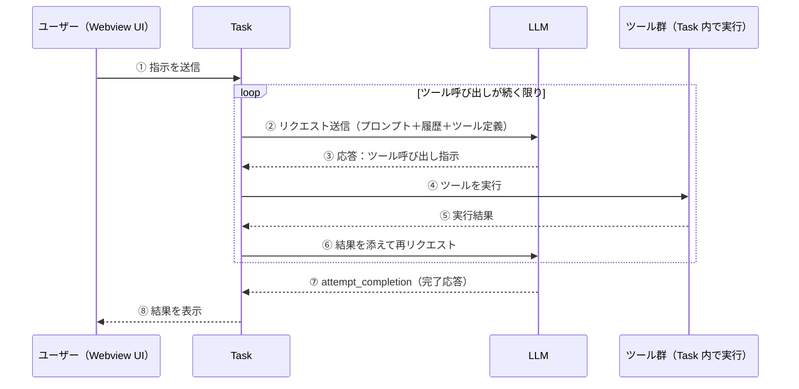

# アーキテクチャ

本書は、VS Code 拡張として動作する AI コーディングエージェント **Local Code Agent**（Roo Code の Apache-2.0 フォーク）のアーキテクチャを解説する。第 1 部「概要」ではシステムの動作原理と全体構造を、第 2 部「内部実装」ではコードを変更する開発者向けに各コンポーネントの詳細を説明する。

LLM プロバイダは OpenAI 互換の 1 種類のみである（Azure OpenAI を含む）。テレメトリは存在せず、既定の外部通信は設定した LLM への 1 本のみである（web_fetch とリモート MCP はオプトインで、有効化した場合のみ通信先が増える）。

## 目次

**第 1 部　概要**

1. [動作原理（ツール実行ループ）](#1-動作原理ツール実行ループ)
2. [リポジトリ構成](#2-リポジトリ構成)
3. [実行時構成と境界](#3-実行時構成と境界)
4. [リクエストループ](#4-リクエストループ)
5. [コンポーネント間シーケンス](#5-コンポーネント間シーケンス)

**第 2 部　内部実装**

6. [Webview UI の構成](#6-webview-ui-の構成)
7. [主要コンポーネント](#7-主要コンポーネント)
8. [core/task の内部](#8-coretask-の内部)
9. [ビルドと品質ゲート](#9-ビルドと品質ゲート)
10. [構成上の備考](#10-構成上の備考)

---

# 第 1 部　概要

システムの動作原理と全体構造。前提知識は不要である。

## 1. 動作原理（ツール実行ループ）

本拡張は一問一答のチャットではなく、**ツール実行ループ**として動作する。ユーザーの指示を受け取ると LLM に送信し、LLM は応答として**ツール呼び出し**（「`read_file` を実行せよ」「この差分を適用せよ」といった指示）を返す。拡張ホストがそのツールを実際に実行し、**結果を会話履歴に追加して再度 LLM に送信する**。LLM が完了（`attempt_completion`）を返すまでこのループを繰り返す。以降の各節は、このループを異なる粒度で示したものである。

```
ユーザーの指示 → LLM → ツール呼び出し → 拡張ホストが実行 → 結果を LLM へ → …繰り返し… → 完了
```

## 2. リポジトリ構成

コードは pnpm workspaces による複数パッケージ構成であり、turbo で一括ビルドされる。すべてのパッケージは最終的に**単一の VS Code 拡張**を構成する。



矢印は依存の向き（依存する側 → 依存される側）。lint / tsc 設定用の config-eslint / config-typescript は省略。webview-ui の実行時依存は types のみで、拡張ホストの実装からは分離されている。

## 3. 実行時構成と境界

実行時の構成要素は 3 つ：**Webview UI**・**拡張ホスト**・**LLM**。アプリケーション内部の境界は postMessage（①）と HTTP（②）の 2 つだが、これに加えて**ツール実行が操作する外部リソース**（ターミナル・ファイルシステム・MCP サーバ）が実質的な信頼境界となる。



矢印は呼び出しの向き。実行結果と状態は Task → ClineProvider → Webview UI の順に通知され、UI が更新される。ツール実行はターミナル・ファイルシステム・MCP サーバ（外部プロセスまたはリモート）に作用する。

## 4. リクエストループ

§1 のループの内部を段階順に示す。**ステップ 2〜5 がツール呼び出しのたびに繰り返され、ステップ 6 で継続可否を判定する**。各ステップには対応する関数名を添えた（コードを追う場合の起点）。

1. **ユーザーが指示を送信する** — Webview UI から入力。新規タスク、または実行中タスクへのフォローアップ。
2. **送信内容を組み立てる** — `@ファイル` 参照の展開と、プロジェクトの環境情報（開いているファイルなど）の付加を行う。（`prepareRequestCycle`）
3. **LLM に送信する** — レート制限に応じて待機し、会話履歴が長い場合は自動要約（condense と呼ぶ）で圧縮した上で、システムプロンプト・履歴・ツール定義を送信する。（`attemptApiRequest` → `api.createMessage`）
4. **応答をストリームで受信する** — 逐次届く断片を種類（本文テキスト / 推論 / ツール呼び出し）別に処理する。（`runStreamingLoop` → `processStreamChunk`）
5. **ツール呼び出しを実行する** — 必要に応じてユーザーの承認を求め、ファイル変更は差分としてプレビュー適用する。実行結果を会話履歴に追加する。（`presentAssistantMessage`）
6. **継続を判定する** — ツールを実行した場合は、その結果とともにステップ 2 へ戻る。（`runRecursiveClineLoop`。スタック駆動）
7. **完了を報告する** — LLM が `attempt_completion` を返した時点でループを終了し、結果を表示する。

中断要求は断片の境界ごとに確認される。API エラーが発生した場合は指数バックオフで再試行し、コンテキストウィンドウを超過した場合は自動要約で圧縮して同じループに戻る。

## 5. コンポーネント間シーケンス

同じループをコンポーネント間のメッセージとして示す。注意：**ツール群は独立したプロセスではなく、Task と同一プロセス内で実行される関数群**である（レーンは論理的な役割の分離を示す）。



③〜⑤：LLM はファイルシステムなどを直接操作できない。操作は必ず Task によるツール実行を経由し、その結果のみが LLM に渡る。

---

# 第 2 部　内部実装

コードを変更する開発者向け。各コンポーネントの構成、ビルドと品質ゲート、構成上の備考。

## 6. Webview UI の構成

UI は独立した React + Vite アプリケーションで、サンドボックス化された Webview 内で動作する。拡張ホストとは postMessage によるメッセージ交換のみで通信し、UI 状態は単一の React Context に集約される。

| 要素                            | 役割                                                                                              |
| ------------------------------- | ------------------------------------------------------------------------------------------------- |
| `index.tsx` → `App.tsx`         | エントリポイント                                                                                  |
| `ExtensionStateContext`         | UI 全体の状態を保持する単一の React Context。ホストからの状態通知で更新されると UI が再描画される |
| `utils/vscode.ts`               | postMessage の薄いラッパ                                                                          |
| `ClineProvider`（拡張ホスト側） | Webview の生成と状態通知                                                                          |
| `webviewMessageHandler`         | 受信メッセージをドメイン別ハンドラへ振り分け                                                      |

主要ビュー: chat（メイン）/ settings / history / modes / mcp / welcome / worktrees / ui・common（共通部品）。

スタイルは Tailwind CSS・VS Code Webview UI Toolkit・Radix UI。表示言語は日本語と英語（`TranslationContext`）。

## 7. 主要コンポーネント

中核の 2 クラス（Task / ClineProvider）は、公開 API を持つ薄い facade と、状態を保持する小さな collaborator 群に分割されている。

| コンポーネント    | 役割                                                                                                                                                                                                                                                                                                        |
| ----------------- | ----------------------------------------------------------------------------------------------------------------------------------------------------------------------------------------------------------------------------------------------------------------------------------------------------------- |
| **Task**          | タスク 1 件のライフサイクル全体を管理する中核クラス。実処理は collaborator 群と手続き関数群に委譲する（→ §8）。サブタスクはスタックにより入れ子で管理される                                                                                                                                                 |
| **ClineProvider** | Webview の保持と Task スタックの管理を担う。タスクスタック / モード / プロバイダ設定の各コントローラなど約 20 の collaborator に責務を分散する                                                                                                                                                              |
| **api/providers** | LLM 呼び出し層。`openai` とテスト用 `fake-ai` 以外はハンドラ構築時に例外で拒否される。LLM 呼び出し・接続テスト・web_fetch は `getProxyDispatcher()` を経由する（http / https / socks5）。リモート MCP は別経路                                                                                              |
| **tools**         | LLM が呼び出せる操作の実装。モードごとに使用できる範囲が制限される。ファイル操作（read_file / apply_diff / edit_file / write_to_file など）と探索・実行（codebase_search / execute_command / MCP ツール / web_fetch）。実行前のユーザー承認と `.agentignore` / `.agentprotected` によるファイル保護を備える |
| **services**      | mcp（Model Context Protocol による外部ツールサーバ連携）/ コードインデックス・tree-sitter・ripgrep・検索 / checkpoints（作業ツリーに影響しないシャドウ git リポジトリへのスナップショット保存）/ skills・command・agent-config                                                                              |
| **integrations**  | terminal（コマンド実行）/ editor（差分のプレビュー適用）/ diagnostics・workspace・theme・misc                                                                                                                                                                                                               |
| **core/prompts**  | システムプロンプトを節単位で組み立てる（役割 / ツール使用 / 能力 / ルール / 目的 / ユーザー設定）。目的（OBJECTIVE）節には、計画の事前提示と完了前検証の指示を含む                                                                                                                                          |
| **core/config**   | `ContextProxy` が設定と秘密情報の単一の入口。API キーは VS Code の SecretStorage（OS のキーチェーン相当）に保存され、平文ファイルには書き出されない                                                                                                                                                         |

**モード**とは Code / Ask / Architect などの作業の役割設定であり、モードごとに使用できるツールと編集可能なファイルが変わる（例：Architect モードは .md ファイルのみ編集可）。

> **命名について**：コード中に頻出する `Cline*`（`ClineProvider` など）は CLI とは無関係で、上流プロジェクト Cline（→ Roo Code → 本フォーク）に由来する名称である。単体の CLI（apps/cli）は削除済み。

## 8. core/task の内部

`src/core/task/` はエージェントループの実装であり、リポジトリで最も情報密度が高い領域である。`Task` クラスは薄い facade で、状態は collaborator が所有し、手続きは `run*` / `finalize*` などの関数モジュールが担う。関数モジュールは Task の具象型ではなく狭い host インタフェースだけを要求する（循環依存の抑止）。

### 主な collaborator（状態の所有者）

| collaborator                 | 所有する状態 / 責務                                                                      |
| ---------------------------- | ---------------------------------------------------------------------------------------- |
| `TaskMessageStore`           | 2 つの会話配列（API 履歴 / UI メッセージ）の保持とディスク入出力                         |
| `StreamingSession`           | 1 リクエスト分のストリーミング状態（バッファ・ライフサイクルフラグ・中断用コントローラ） |
| `AskState`                   | Webview への問い合わせとその応答の待機                                                   |
| `MistakeTracker`             | 連続失敗回数と、差分適用失敗の追跡                                                       |
| `TokenUsageTracker`          | トークン・ツール使用量の集計と通知                                                       |
| `ApiRequestTimingController` | レート制限の待機と、失敗時の指数バックオフの告知                                         |
| `GraceRetryCounter`          | 空応答リトライの猶予カウンタ                                                             |
| `TaskModeState`              | モードとプロバイダプロファイルの状態                                                     |
| `TaskLauncher`               | 起動元（新規 / 履歴からの再開）の確定                                                    |
| `TaskSubscriptions`          | 外部イベント購読の登録と一括解除                                                         |

### ループの各層

`recursivelyMakeClineRequests()` から始まる呼び出しは、明示的なスタックを回すループとして実装されている（関数の再帰ではない）。

| 層                        | 役割                                                                                    |
| ------------------------- | --------------------------------------------------------------------------------------- |
| `runRecursiveClineLoop`   | スタックが空になるまで回す最上位ループ。中断確認と連続失敗の上限判定を行う              |
| `prepareRequestCycle`     | メンション展開・環境情報の付加・ユーザーメッセージの履歴登録                            |
| `runOneRequest`           | ストリーミング状態の初期化と API リクエストの発行                                       |
| `runOneApiIteration`      | 1 リクエスト分の実行。ストリーム処理・途中エラーの処理・完了処理を束ねる                |
| `runStreamingLoop`        | 中断と競合させながらストリームの断片を順に取り出す                                      |
| `processStreamChunk`      | 断片を種類別（テキスト / 推論 / 使用量 / ツール呼び出し）に振り分ける薄いディスパッチャ |
| `presentAssistantMessage` | 応答内容の提示とツール実行。再入ロックにより並行実行を防ぐ                              |

## 9. ビルドと品質ゲート

拡張ホスト側は esbuild で単一ファイルにバンドルされ、Webview UI は Vite でビルドされて成果物に同梱される。ビルドタスクの実行には turbo を用いる。外部 CI に依存しない運用方針のため GitHub Actions は使用せず、ローカルで実行する `pnpm ci:local --strict` が唯一の品質ゲートである。

1. **install**（--frozen-lockfile）
2. **i18n**（翻訳漏れ検査）
3. **knip**（未使用コード検出）
4. **format**（prettier --check）
5. **lint**（eslint。警告ゼロ）
6. **check-types**（tsc 型検査）
7. **lint:cycles**（循環依存の検出。循環ゼロを維持）
8. **unit test**（vitest。変更したファイルは分岐網羅 100% が基準）
9. **e2e**（本拡張を実際に起動する smoke テスト）

git フック（husky）は別レイヤの軽量チェックである。pre-commit では main への直接コミットを禁止し、prettier と eslint を実行する。pre-push では tsc を実行する。完全な検証はゲートが担い、コミット時は最小限のチェックのみを行う二層構成である。

## 10. 構成上の備考

いずれも動作上の問題ではなく、上流構成の名残による維持コストに関するものである。

- **パッケージ分割が実態より細かい。** `core` と `ipc` は複数の配布物（CLI など）で共有する前提で上流が切り出したものだが、CLI 削除後の依存元は `src` のみ。パッケージごとの設定とビルドが残るぶん、またがる変更の手間が増える。ただし `core` の「VS Code API に依存しない」という層の境界には設計上の意味があるため、統合する場合は lint などで境界を維持する必要がある。
- **ディレクトリ配置に上流の未完了の意図が残る。** `pnpm-workspace.yaml` の「# Should be apps/vscode」というコメントは、`src` を `apps/` 配下へ移す予定のまま放置されたもの。動作への影響はない。

---

各論は [mcp.md](mcp.md)（MCP 連携）・[webview.md](webview.md)（Webview の詳細）・[diff-and-checkpoints.md](diff-and-checkpoints.md)（差分プレビューとチェックポイント）を参照。
