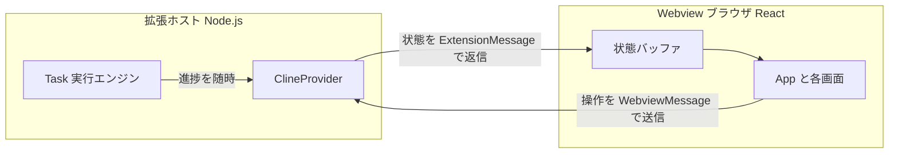
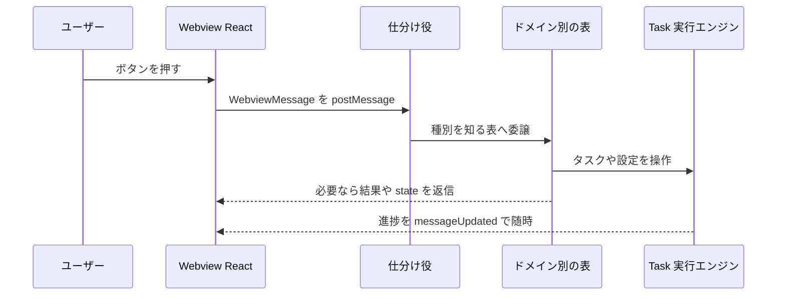
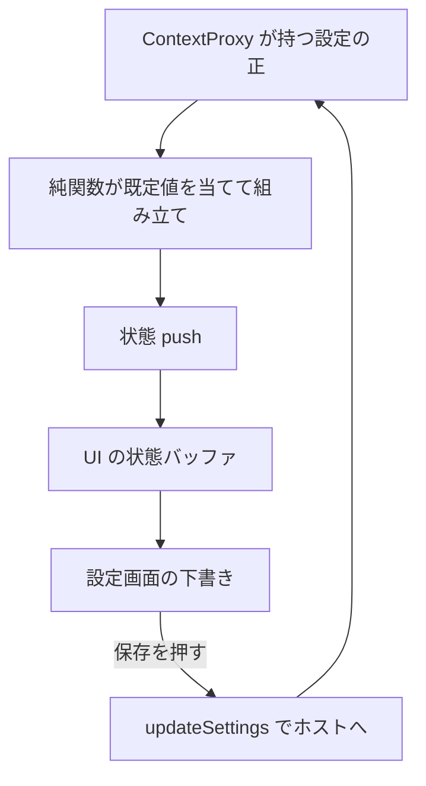

# Webview（拡張ホスト ↔ React UI）

この拡張機能の画面（チャット・設定・履歴）は、ロジックを動かす部分と画面を描く部分が
**別々のプロセスで動き、メッセージのやり取りだけでつながっている**。この文書は
「その 2 つが何をして、どう会話しているか」を、コードの固有名詞をなるべく避けて説明する。
まず全体像をつかんでから、行き帰りのメッセージ、状態の流れ、画面の中身、と降りていく。

---

## 全体像 — 2 つのプロセスが postMessage で会話する

この機能は、**役割の異なる 2 つの世界**が協調して動いている。

1. **拡張ホスト側（Node.js の世界）** — VSCode 本体の中で動く。ファイルを読み書きし、
   AI プロバイダに問い合わせ、ターミナルを操作し、設定を永続化する。要するに
   「実際に手を動かす」側で、UI は一切描かない。

2. **Webview 側（ブラウザの世界）** — VSCode がサイドバー（またはエディタタブ）の中に
   埋め込む、小さなブラウザ（iframe に近いもの）。中身は React + Vite で作った
   1 枚の SPA で、チャットの吹き出しや設定フォームを描く。ファイルには直接触れない。

この 2 つは**メモリを共有できない**。できるのは、VSCode が用意した郵便受け
（`postMessage`）に JSON を投函し合うことだけ。UI 側でボタンを押すと「これをやって」
というメッセージがホストへ飛び、ホストは処理結果や最新状態を「これが今の状態」という
メッセージにして UI へ送り返す。**画面に見えるものはすべて、ホストから届いた状態を
React が描き直した結果**であり、UI 自身が真実を持っているわけではない。

- 入口（ホスト側のプロバイダ）: `src/core/webview/ClineProvider.ts`
- 入口（UI 側のルート）: `webview-ui/src/App.tsx`

---

## 起動 — 空っぽの画面が中身を取りに行くまで

VSCode がサイドバーを開くと、ホスト側のプロバイダにある**画面初期化の担当**が呼ばれる。
この担当がやることは決まっている。パネルがサイドバーなのかエディタタブなのかを見分け、
ターミナルや読み上げの設定値を実行モジュールへ流し込み、Webview がローカルファイル
（ビルド済みの JS/CSS や画像）を読み込めるようアクセス許可の範囲を決め、そして
**画面の骨組みとなる HTML を流し込む**。あわせて「UI から届くメッセージを聞く耳」を
セットし、可視状態やテーマ変更を監視するリスナを登録し、前回のセッションで中途半端に
残ったタスクがあれば掃除する。

- 入口: `src/core/webview/initializeWebview.ts`

流し込む HTML を組み立てるのは**HTML 生成の担当**で、本番と開発でやり方が変わる。
本番では、ビルド済みの JS と CSS を指す `<script>`/`<link>` を埋め込み、外部からの
読み込みを厳しく禁じる CSP（コンテンツセキュリティポリシー）と、毎回変わる使い捨ての
乱数（nonce）を付ける。開発時は Vite の HMR（保存すると即反映される仕組み）を使うため、
ローカルの Vite サーバが生きているか実際に叩いて確認し、生きていればそのサーバを指す
`<script>` と React Fast Refresh の仕掛けを注入する。サーバが落ちていれば本番向け HTML に
フォールバックする。画像や音声・アイコンのベース URI は、ホストにしか作れない
webview 専用 URI に変換して `window` 変数として渡す。

- 入口: `src/core/webview/WebviewContentGenerator.ts`

HTML が入ると React が起動する。React 側は最初のレンダリングで
**「準備できました」というメッセージ（`webviewDidLaunch`）をホストへ送る**。
これがブートストラップの合図になる。ホストはこれを受けて、
現在の状態一式を UI へ push し、テーマ・MCP サーバ一覧・API 設定プロファイル一覧を
順に送る。最初のうち画面は空（`didHydrateState` が false）で何も描かず、状態が
1 回届いた瞬間に本来の画面へ切り替わる。なお `webviewDidLaunch` は `App.tsx` と
`ExtensionStateContext.tsx` の 2 か所の初回 `useEffect` から送られ、ホスト側の起動処理も 2 回走る（冪等）。

- 入口（起動通知の送信側）: `webview-ui/src/App.tsx` / `webview-ui/src/context/ExtensionStateContext.tsx`
- 入口（起動通知の受信側 = 唯一残った switch 分岐）: `src/core/webview/webviewMessageHandler.ts`

---

## メッセージフロー（UI → ホスト） — 操作を仕分けて担当へ渡す

UI 側でユーザーが何かすると、その操作は**種類（`type`）を持った 1 個のメッセージ**として
ホストへ飛ぶ。「新しいタスクを始めて」「この設定を保存して」「このチェックポイントに戻して」
といった具合で、送りうるメッセージの種類は 1 か所の型定義に集約されている。

- メッセージの語彙（UI → ホスト）: `packages/types/src/vscode-extension-host.ts`（`WebviewMessage`）

ホストに届いたメッセージは、まず**入口の仕分け役**が受け取る。かつてここは巨大な
`switch` 文で、すべてのメッセージ種別を 1 か所で捌いていた。今はそれを解体し、
**ドメインごとに「メッセージ種別 → 処理関数」の対応表（マップ）を作って、順に引く**方式に
なっている。仕分け役は、worktree 用の表・コード索引用の表・モード用の表…と
順番に該当の有無を確認し、最初に見つかった処理関数に委譲する。
どの表も知らなければ、唯一 `switch` に残った起動処理（前述の起動通知）へ落ちる。
この作りのおかげで、機能を足すときは対応する表に 1 エントリ追加するだけで済み、
巨大 switch の再来を防いでいる。

- 入口（仕分け役）: `src/core/webview/webviewMessageHandler.ts`

各ドメインの表（sub-handler）は、それぞれ守備範囲がはっきり分かれている。
どれも「具体的なプロバイダクラスを直接は知らず、必要な操作だけを列挙した細い窓口
（`WebviewMessageHost`）越しに呼ぶ」形になっていて、これが層どうしの循環参照を防いでいる。

- 細い窓口の定義: `src/core/webview/webviewMessageHost.ts`

- **タスク操作の表** — 一番大きい。タスクの新規作成・キャンセル・破棄、履歴タスクの
  表示や削除やエクスポート、チャットメッセージの編集/削除（確認ダイアログの往復を含む）、
  送信待ちメッセージのキュー、自動承認まわりを担う。
  `src/core/webview/taskMessageHandlers.ts`
- **API 設定プロファイルの表** — 接続テスト、プロファイルの読み込み/名前変更/削除、
  一覧メタデータやピン留めの同期を扱う。`src/core/webview/apiConfigMessageHandlers.ts`
- **設定の表** — 設定フォームの一括保存、設定のインポート/エクスポート、限定した
  VSCode 設定の読み書きを担う。`src/core/webview/settingsMessageHandlers.ts`
- **MCP の表** — MCP サーバの再起動・有効無効・タイムアウト変更・ツール許可の切替。
  `src/core/webview/mcpMessageHandlers.ts`
- **コード索引の表** — コードベース索引の開始/停止/消去や状態問い合わせ、秘密情報の
  保存状況の返答を扱う。`src/core/webview/codeIndexMessageHandlers.ts`
- **モードの表** — モードの切替と一覧の問い合わせを担う。
  `src/core/webview/modeMessageHandlers.ts`
- **スラッシュコマンドの表** — コマンド一覧の要求、コマンドファイルの作成/削除/オープン。
  `src/core/webview/commandMessageHandlers.ts`
- **worktree の表** — Git worktree の一覧・作成・削除・ブランチ操作・コピー進捗を扱う。
  `src/core/webview/worktreeMessageHandlers.ts`
- **プロンプトの表** — システムプロンプトの取得/コピー、プロンプト強化、モード別カスタムプロンプト（`customModePrompts`）更新、OpenAI 互換エンドポイントのモデル一覧取得。
  `src/core/webview/promptMessageHandlers.ts`
- **読み上げ（TTS）の表** — 音声の再生/停止、有効無効と速度の反映。
  `src/core/webview/ttsMessageHandlers.ts`
- **スキルの表** — スキルの一覧取得・作成・削除・移動・対応モード割当・ファイルを開く。`src/core/webview/skillsMessageHandler.ts`
- **ファイル操作の表** — 画像/ファイルのオープン、メンション解決、ファイル内容の読み出し。
  `src/core/webview/fileEditorMessageHandlers.ts`
- **UI 操作とチェックポイントの表** — パネルフォーカス、タブ切替、宣伝表示の非表示化、
  チェックポイントの差分表示/復元を担う。`src/core/webview/uiMessageHandlers.ts`

---

## メッセージフロー（ホスト → UI） — 状態を丸ごと押し付ける

逆向き、ホストから UI へ送るメッセージも 1 か所の型定義に集約されている。
種類は「テーマが変わった」「MCP サーバ一覧が更新された」「このダイアログを出して」など
多岐にわたるが、**最重要なのは状態 push（`state`）**である。

- メッセージの語彙（ホスト → UI）: `packages/types/src/vscode-extension-host.ts`（`ExtensionMessage`）

プロバイダには「今の状態を UI へ送る」入口があり、送信用の状態オブジェクトを組み立てて
`state` メッセージとして投げる。UI 側はこれを受け取り、自分が持っている状態に
マージして React を再描画する。状態 push には**連番（seq）**が振ってあり、非同期に
複数の push が前後して届いても、UI は古い連番の push でチャット内容を上書きしない
（設定変更とチャット streaming が同時に走ると起きうる競合を防ぐ仕掛け）。

- 状態を送る入口: `src/core/webview/ClineProvider.ts`（`postStateToWebview`）

状態は重いので、プロバイダは用途に応じて**軽量版の push**も持っている。チャットが
1 文字進むたびに巨大な履歴まで送り直すのは無駄なので、履歴を省いた push や、
逆にチャット内容を省いた push（設定変更用）を使い分ける。さらに履歴の更新は、
全部を送り直す代わりに「この 1 件だけ変わった」という差分メッセージで届ける経路もある。
チャットが streaming 中の 1 メッセージ更新に至っては、Task 実行エンジンがプロバイダへの
弱参照を通じて `messageUpdated`（該当の 1 吹き出しだけ）を直接 UI へ送り、UI は
タイムスタンプで該当吹き出しを探して差し替える。

- streaming の 1 件更新の送信元: `src/core/task/Task.ts`（`updateClineMessage`）

タスクのライフサイクル（開始・完了・中断など）は、Task が発火するイベントを
プロバイダが**同名イベントとして中継**する仕組みで拾っている。listener は配列から機械的に
組み立てて、タスクがスタックから外れる時にまとめて解除するので、登録と解除の対応漏れが
起きない。

- イベント中継の配線: `src/core/webview/taskEventForwarding.ts`

---

## 状態の流れ — 設定が画面に映り、「保存」で書き戻るまで

ホスト側の設定の**唯一の正**は、永続化を仲介するレイヤ（ContextProxy）が持っている。
UI へ送る状態は、ここから読んだ生の設定値に既定値を当てはめて組み立てる。組み立ては
2 段階の純関数に分かれていて、まず「設定値 + 追加情報」から内部状態を作り、次にそれを
「UI が扱いやすい最終形（`ExtensionState`）」へ整える。未設定のキーに `?? 既定値` を
当てるのはこの純関数の役目で、既定値の適用ロジックが 1 か所に集まっている。

- 生値 → 内部状態: `src/core/webview/buildState.ts`
- 内部状態 → UI 送信用: `src/core/webview/buildExtensionState.ts`

UI 側は、届いた状態を**React Context のバッファ**に溜める。画面のどこからでも
`useExtensionState()` でこのバッファを読めるようになっていて、状態 push が届くたびに
浅いマージで更新される。カスタムプロンプトや experiments のように「上書きだけを保持する」
フィールドはマージ順を工夫し、チャット内容は前述の連番ガードで守る。

- 状態バッファ: `webview-ui/src/context/ExtensionStateContext.tsx`

設定画面はさらにもう一段バッファを重ねる。フォームを開いた瞬間に**現在の状態を
ローカルの下書き（cachedState）へコピー**し、ユーザーの編集はまず下書きだけを書き換える。
このとき「変更あり」フラグが立ち、保存ボタンが押せるようになる。**「保存」を押して初めて**、
下書き一式が `updateSettings` メッセージとしてホストへ飛ぶ。ホストの設定の表は届いた
各キーを永続化し、i18n・読み上げ・ターミナル・MCP のように即時反映が要るものは
実行モジュールへ適用してから、状態を UI へ push し直す。つまり**編集は下書き、確定は往復**、
という二段構えになっている。

- 下書きと保存: `webview-ui/src/components/settings/SettingsView.tsx`
- 保存の受け口: `src/core/webview/settingsMessageHandlers.ts`（`updateSettings`）

---

## 主要画面 — チャットと設定

UI のルートは、タブ（チャット/設定/履歴）を切り替えるだけの薄い階層で、
状態がまだ届いていなければ何も描かない。ホストから届く「チャットボタンが押された」
などのアクションに応じてタブを切り替え、削除/編集の確認ダイアログもここで開く。

- 入口: `webview-ui/src/App.tsx`

### チャット画面

チャット画面は、状態バッファ内のメッセージ配列を**吹き出しの列**として描く。1 件ずつを
描く行コンポーネントが、AI の発話・ツール実行・コマンド出力・推論ブロック・TODO 更新など
種類ごとに見た目を変える。画面の要は**ask/承認の往復**で、AI が「このコマンドを実行して
いいか」などと尋ねると、状態に応じて承認/拒否のボタンが有効化され、ユーザーの返答は
`askResponse` メッセージとしてホストへ返る。AI が streaming 中だったり、直前の質問が
まだ捌けていない場合、ユーザーの新規入力は**送信キュー**に積まれ、手が空いてから順に
処理される（キューの中身も状態として UI に映る）。入力欄はメンション補完や画像添付、
Enter の挙動切替（送信か改行か）にも対応する。

- 画面本体: `webview-ui/src/components/chat/ChatView.tsx`
- 1 件を描く行: `webview-ui/src/components/chat/ChatRow.tsx`
- 入力欄: `webview-ui/src/components/chat/ChatTextArea.tsx`

### 設定画面

設定画面は左に縦のタブ、右に各セクションのフォームを並べる。プロバイダ接続・モード・
スキル・スラッシュコマンド・自動承認・MCP・チェックポイント・通知・コンテキスト管理・
ターミナル・プロンプト・worktree・表示・実験機能・言語・情報、といったセクションを持つ。
各フォーム部品は前述の下書き（cachedState）を書き換えるだけで、確定は保存ボタン 1 つに
集約される。プロバイダ設定は OpenAI 互換のモデル選択やパラメータ調整を提供する。

- 画面本体: `webview-ui/src/components/settings/SettingsView.tsx`
- プロバイダ設定群: `webview-ui/src/components/settings/providers/`

### 共有ブリッジとエイリアス

UI からホストへメッセージを送る口は、**VSCode API を 1 枚で包んだ薄いラッパ（シングルトン）**に
まとまっている。VSCode 上では本物の `postMessage` を、素のブラウザで動かす開発時は
コンソール出力や localStorage で代用するので、UI コードはどちらでも同じ書き方で動く。
また、UI 側のビルドには `@src/*`（UI 自身）と `@agent/*`（拡張ホストと共有する型や定数）の
エイリアスが設定されていて、ホスト/UI 間で語彙をずれなく共有している。

- ブリッジ: `webview-ui/src/utils/vscode.ts`
- エイリアス定義: `webview-ui/vite.config.ts`, `webview-ui/tsconfig.json`

---

## プロバイダの内部構造 — 18 の担当への分割

ホスト側のプロバイダ（ClineProvider）は、外から見ると「webview を持ち、タスクの山を管理し、
状態を push する 1 個のクラス」に見える。しかし中身は**薄い取次ぎ役（facade）**で、
実際の仕事は**18 の専門担当（collaborator）**に振り分けている。プロバイダのコンストラクタは
これらを自分で `new` せず、**配線専用の組み立て役から受け取って代入するだけ**にしてある。
こうすると、依存関係が 1 か所で読め、テスト時は担当一式を丸ごと差し替えられる。

- プロバイダ本体: `src/core/webview/ClineProvider.ts`
- 担当の組み立て（配線図）: `src/core/webview/buildProviderCollaborators.ts`

主な担当が実際にやっていること:

- **タスクの山の管理** — 実行中タスクを LIFO で積み、サブタスクを子として重ねる。
  子が終われば親が復帰する。
- **タスク履歴の保存と読み出し** — タスクごとにファイル永続化し、集計コストつきで読み出す。
  互換のためグローバル状態への書き戻しはデバウンスで行う。
- **タスクの委譲・削除・キャンセル** — 親から子への委譲と復帰、履歴とチェックポイントを
  含む削除、実行中タスクの安全な中断をそれぞれ受け持つ。
- **モード切替とプロバイダプロファイル** — モード変更に伴う API 設定の連動、プロファイルの
  作成/有効化/削除を扱う。
- **履歴からの復元** — 履歴タスクを開くとき、保存されていたモードと API 設定を復元する。
- **コード索引の状態購読** — 現在ワークスペースの索引状況を購読し、UI へ流す。
- **編集の保留管理** — チェックポイント復元をまたぐメッセージ編集を一時保持し、後で再生する。
- **HTML 生成** — 前述の画面 HTML 組み立て担当も、この一員として保持される。
- **MCP ハブ / スキル** — 起動後に非同期で初期化され、解決後にプロバイダが保持する（`startBackgroundInitialization`）。**ワークスペース追跡**は factory 内で同期的に生成され即保持される（ファイルパスの初期化のみ `webviewDidLaunch` 内で非同期）。

プロバイダに残った公開メソッドの多くは「対応する担当へそのまま渡すだけ」の 1 行取次ぎで、
状態 push まわりのように複数担当をまたぐ調整だけがプロバイダ自身に残っている。

---

## まとめ

- 動かす側（ホスト）と描く側（Webview）は別プロセスで、**メッセージのやり取りだけ**で
  つながる。画面は常にホストから届いた状態の写像である。
- **UI → ホスト**は種別つきメッセージを「ドメイン別の対応表」で仕分けて担当へ委譲する
  （巨大 switch を解体した設計）。**ホスト → UI**は状態を丸ごと push するのが基本で、
  重さ対策の軽量 push と、streaming の 1 件差分更新を併用する。
- 設定は「ホストの正 → 既定値を当てて組み立て → UI のバッファ → 設定画面の下書き →
  保存で往復」という流れで、編集は下書き・確定は往復に分かれている。
- プロバイダは薄い取次ぎ役で、実務は 18 の専門担当に分割され、配線は 1 か所に集約されている。

---

## 拡張・変更の起点

- **新しい webview メッセージを足す** — `WebviewMessage`（`packages/types/src/vscode-extension-host.ts`）に型を足し、該当ドメインの `*MessageHandlers.ts` のマップに 1 エントリ追加する（`webviewMessageHandler` の巨大 switch は分割済みなので触らない）。
- **新しい設定項目を足す** — `ExtensionState` に足し、`buildExtensionState` で組み立て、`SettingsView` に UI を追加。UI 側は `cachedState` に下書き → 保存で反映。
- **UI へ push する状態を変える** — `getStateToPostToWebview` / `buildExtensionState`。全体 push か軽量 push（`postStateToWebviewWithoutTaskHistory`）かを選ぶ。

## 既知の注意

- `webviewDidLaunch` は `App.tsx` と `ExtensionStateContext.tsx` の 2 か所から送られ、ホストの起動処理も 2 回走る（冪等前提）。
- `ClineProvider` は 18 collaborator に責務分割された facade。公開メソッドの多くは担当への 1 行取次ぎで、直接ロジックを足すより担当側に足すのが筋。
