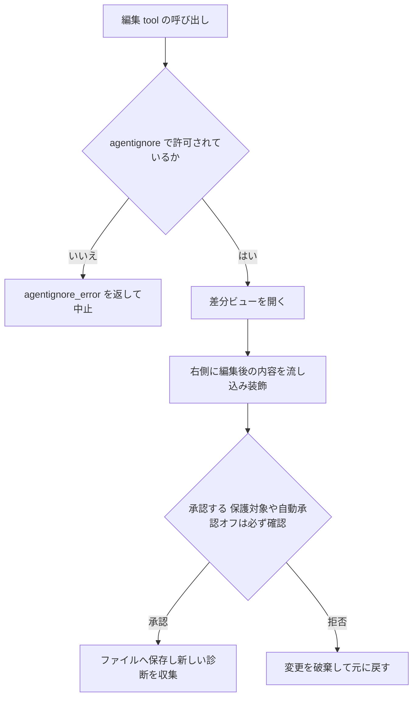
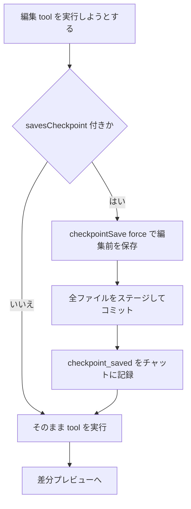

# ファイル編集の差分プレビューとチェックポイント

このドキュメントは、エージェントがファイルを書き換えるときの 2 つの安全網を説明します。

- **差分プレビュー**: エージェントが加えようとしている変更を、確定する前にエディタ上の差分ビューで見せ、承認/破棄できるようにする仕組み。
- **チェックポイント**: 編集のたびに作業ツリー全体のスナップショットを裏で取り、あとから「編集前に戻す」「何が変わったか見る」を可能にする仕組み。

どちらも「エージェントの変更を、ユーザーがいつでも確認・取り消しできる」ことを目的にしています。

---

## 1. ファイル編集の差分プレビュー

### 1.1 全体の流れ

エージェントがファイルを書き換える tool（`write_to_file` / `apply_diff` / `edit_file` など）を呼ぶと、変更はいきなりディスクに書かれるのではなく、次の順で処理されます。

1. **アクセス保護のチェック** — そのパスを触ってよいか確かめる。
2. **新しい内容を組み立てる** — `apply_diff` の場合は「検索置換ブロック」を元ファイルに当てて新しい内容を作る。
3. **差分ビューを開く** — 左に元ファイル（読み取り専用）、右に編集後を並べ、変更をアニメーションで流し込む。
4. **承認を求める** — ユーザーが承認するか、自動承認設定で通す。保護対象ファイルは設定に関わらず必ず確認。
5. **確定 or 破棄** — 承認ならファイルに保存し、拒否なら元に戻す。



主な入口ファイル:

- `src/core/tools/WriteToFileTool.ts` — ファイル全体を新規作成/上書きする tool。
- `src/core/tools/ApplyDiffTool.ts` — 検索置換ブロックで部分編集する tool。
- `src/core/tools/EditFileTool.ts` — 新形式の編集 tool。差分ビューの使い方は上記と同じ。
- `src/integrations/editor/DiffViewProvider.ts` — 差分ビューの開閉・流し込み・確定・破棄を担う中核。

### 1.2 編集前の保護（agentignore / agentprotected）

ファイルに触る前に、2 つのコントローラが「そもそも編集してよいか」を判定します。

- **`.agentignore`（アクセス禁止）** — `src/core/ignore/AgentIgnoreController.ts`。ワークスペース直下の `.agentignore` を `.gitignore` と同じ書式で読み込み、そこに載っているパスへのアクセスを完全にブロックします。編集 tool は最初に `validateAccess(relPath)` を呼び、拒否されたら編集を始めず `agentignore_error` を返します。シンボリックリンクは実体パスに解決してから判定し、ファイルの内容を読む種類のシェルコマンド（`cat` / `grep` など）も引数のパスを検査します。`.agentignore` が無ければ全許可です。

- **`.agentprotected`（書き込み保護）** — `src/core/protect/AgentProtectedController.ts`。こちらはアクセスを禁止するのではなく、「自動承認をすり抜けさせない」ための仕組みです。`.agentignore` / `.agentrules*` / `.vscode/**` / `AGENTS.md` などエージェント自身の設定に関わるファイル群を、あらかじめ決め打ちのパターンで保護対象としています。編集 tool は `isWriteProtected(relPath)` を呼び、真なら承認要求に「保護中」フラグを立てて渡すので、自動承認が有効でもユーザーの確認が必ず入ります。

### 1.3 差分ビューの仕組み（左=読み取り専用の仮想ドキュメント）

差分ビューは VS Code の標準の差分エディタを使いますが、左右で見せているものが違います。

- **左側（元の内容）** は実ファイルではなく、`cline-diff` という専用スキーム（`DIFF_VIEW_URI_SCHEME`）を持つ**仮想の読み取り専用ドキュメント**です。元ファイルの中身を base64 にして URI のクエリに埋め込み、`src/extension.ts` に登録された内容プロバイダがそれをデコードして返します。実ファイルではないので、ここは絶対に書き換わりません。
- **右側（編集後）** は実ファイルそのもので、こちらにエージェントの変更が入っていきます。

`open()` はまず差分エディタを開き、`update(accumulatedContent, isFinal)` で新しい内容を**行単位で少しずつ流し込みます**。ストリーミング中は 2 種類の装飾で「いまどこを書いているか」を可視化します（`src/integrations/editor/DecorationController.ts`）。まだ書いていない行には薄いオーバーレイをかけ、書き込み中の行はハイライトし、その行を追ってスクロールします。`isFinal` が来た時点で最終内容に整え、元ファイルが末尾改行で終わっていたら末尾改行を保つなどの正規化を行い、装飾を消します。

### 1.4 確定と破棄

- **確定（`saveChanges`）** — 右側の実ファイルを保存し、差分ビューのタブを閉じます。このとき編集の前後で診断（エラー）を突き合わせ、この編集で新しく増えたエラーだけを拾ってモデルへ返します（linter が追いつくよう設定可能な待ち時間を挟み、warning は無視して error のみ対象）。さらに、ユーザーが承認前にエディタ上で手を加えていた場合はそれを検出し、その差分もモデルに伝えます（`src/integrations/editor/diffViewContent.ts` の純関数群が EOL 正規化・ユーザー編集検出・返答 JSON の組み立てを担当）。
- **破棄（`revertChanges`）** — 新規作成だった場合はファイルを削除し、途中で作ったディレクトリも逆順に消します。既存ファイルの編集だった場合は元の内容に書き戻して保存します。

なお `PREVENT_FOCUS_DISRUPTION` 実験が有効なときは、差分ビューを開かずに `saveDirectly` で直接ファイルへ書き込みます。エディタのフォーカスを奪わないための経路で、承認・診断収集の流れは同じです。

### 1.5 diff 戦略: 検索置換ブロックをどう当てるか

`apply_diff` が渡す差分は「元のこの部分を、この内容に置き換えて」という**検索置換ブロック**の集まりで、その適用ロジックが diff 戦略です（`src/core/diff/strategies/multi-search-replace.ts`）。

1 ブロックは次の形をしています。

```
<<<<<<< SEARCH
:start_line:42
-------
[置き換えたい既存の内容（空白も含めて一致させる）]
=======
[新しい内容]
>>>>>>> REPLACE
```

処理の要点:

- **マーカーの整合性チェック** — SEARCH / `=======` / REPLACE の並びを状態機械で検証し、崩れていれば具体的な直し方（マージ衝突マーカーはエスケープが必要、など）を添えて失敗を返します。
- **一致位置の探索** — まず `:start_line:` の位置で厳密一致を試し、ダメなら周辺の一定行数（バッファ）内を**中央から外へ広げる曖昧検索**で探します。類似度は Levenshtein 距離で測り、`fuzzyThreshold`（既定 1.0 = 完全一致）以上のところを採用します。それでも当たらなければ行番号を剥がすなどのフォールバックを試します。
- **インデント保持** — 見つかった箇所の元インデントを基準に、置換後の各行の相対インデントを合わせて差し込みます。
- **複数ブロックの一括適用** — start_line 順に並べ、置換で増減した行数を running delta として持ち回り、後続ブロックの位置ズレを補正します。当たらなかったブロックは `failParts` として記録され、tool 側が「一部当てられなかったので読み直して再適用して」と促します。

適用後、チャット表示用の統一 diff は `src/core/prompts/responses.ts` の `createPrettyPatch` が組み立て、`src/core/diff/stats.ts` がそれを `sanitizeUnifiedDiff` で正規化しつつ追加/削除行数を数えます（新規ファイルの unified diff 化だけは `stats.ts` の `convertNewFileToUnifiedDiff` が担当）。

### 1.6 編集 tool ごとの差分ビューの使い方

差分ビュー（`DiffViewProvider`）はどの編集 tool からも同じ 4 メソッド（開く・流し込む・確定する・破棄する）で使われますが、そこへ至るまでの前処理が tool ごとに違います。

- **`write_to_file`** — モデルが渡すのは**ファイル全文**です。既存ファイルか新規かを判定し、囲みのコードフェンス（先頭/末尾の三連バッククォート）を落としてから、その内容をそのまま右側へ流し込みます。ストリーミング途中は `isFinal=false` で部分的に、完了時に `isFinal=true` で最終形に整えます。
- **`apply_diff`** — モデルが渡すのは全文ではなく検索置換ブロックです。先に diff 戦略で新しい内容を計算し、その結果を一度に（`isFinal=true`）流し込みます。当てられなかったブロックがあれば結果メッセージにその旨を添えます。
- **`edit_file`** — 新形式の編集 tool ですが、差分ビューの開閉・確定・破棄・直接書き込みの呼び出し方は上記 2 つと同じで、内容の組み立て方だけが異なります。

いずれの経路でも、承認されれば `saveChanges`（または直接書き込みの `saveDirectly`）で確定し、拒否されれば `revertChanges` で元に戻し、最後に `reset` で状態を片付ける、という後半は共通です。

---

## 2. チェックポイント（作業スナップショット）

### 2.1 shadow git という考え方

チェックポイントは、編集のたびにワークスペース全体の状態を裏で記録し、あとから巻き戻せるようにする仕組みです。鍵になるのが **shadow git（影の git）** です。

普通に考えると「ワークスペースに git を作ってコミットする」ですが、それだとユーザー自身の `.git` や履歴を汚してしまいます。そこで shadow git は、**リポジトリ本体（`.git`）をワークスペースの外**（拡張機能のグローバルストレージ）に置き、その**作業ツリー（`core.worktree`）だけをワークスペースに向ける**という配置を取ります。こうすると、ワークスペースの実ファイルを対象にコミットできるのに、ワークスペースには `.git` が一切生えず、ユーザーの git とも完全に独立します。

ディレクトリ配置はタスクごとに 1 リポジトリで、`src/services/checkpoints/RepoPerTaskCheckpointService.ts` が次の場所に作ります。

```
<グローバルストレージ>/tasks/<taskId>/checkpoints/.git   ← 影のリポジトリ本体
ワークスペースのフォルダ                                   ← 影のリポジトリの作業ツリー
```

主な入口ファイル:

- `src/services/checkpoints/ShadowCheckpointService.ts` — shadow git の初期化・保存・復元・差分取得の中核。
- `src/services/checkpoints/RepoPerTaskCheckpointService.ts` — タスク単位のリポジトリ配置を決める薄い派生クラス。
- `src/services/checkpoints/excludes.ts` — スナップショットから除外するパターン一覧。
- `src/core/checkpoints/index.ts` — Task から呼ばれる save/restore/diff の実体とサービス初期化。

### 2.2 初期化で気をつけていること

`initShadowGit` はリポジトリを用意する際に、汚染や事故を避けるための下準備をします。

- **入れ子の git リポジトリを検出** — ワークスペース内に別の `.git` があると影の git と衝突するため、見つかったらチェックポイント機能を無効化して警告します。
- **クリーンな作り方** — `git init --template=""` で空テンプレートを使い、ユーザーの hooks や設定が影リポジトリへ漏れないようにします。コミット署名は無効、コミット主は専用のボット名義です。
- **環境変数の消毒** — `GIT_DIR` や `GIT_WORK_TREE` など、操作先を横取りしかねない git 系の環境変数を取り除いた状態で git を起動し、必ず影リポジトリに対して動くようにします。
- **除外リスト** — `.git/info/exclude`（影リポジトリ内だけに効く除外設定）に、ビルド生成物・`node_modules`・画像や動画・大きなバイナリ・データベース・キャッシュ類、さらに `.gitattributes` の LFS 対象を書き込み、無駄に重いものをスナップショットしないようにします。ワークスペースの `.gitignore` も尊重されます。

### 2.3 いつ save されるか

チェックポイントは**ファイルを書き換える tool を実行する直前**に自動で取られます。tool のディスパッチ表（`src/core/assistant-message/toolDispatch.ts`）は各 tool に `savesCheckpoint` フラグを持ち、`write_to_file` / `apply_diff` / `edit` / `edit_file` / `apply_patch` / `new_task` などがこれを立てています。

該当 tool を実行する前に `src/core/assistant-message/presentToolUse.ts` が `checkpointSaveAndMark` を呼び、`Task.checkpointSave(true)` を実行します。これは 1 回のストリーミング応答につき一度だけ（`currentStreamingDidCheckpoint` ガード）走り、編集が始まる前の状態を確定させます。

保存本体（`saveCheckpoint`）はワークスペースの全ファイルを影リポジトリへステージしてコミットし、コミットハッシュを内部リストに積みます。コミットが実際に生まれると `checkpoint` イベントが発火し、`src/core/checkpoints/index.ts` がそれを受けてチャットに `checkpoint_saved`（from/to のハッシュ付き）を記録します。これが後で「この時点に戻す」ボタンの拠り所になります。



### 2.4 restore で戻す / diff で見る

ユーザーがチャット上のチェックポイントから操作すると、webview のハンドラ経由で Task に委譲されます。

- **復元（`checkpointRestore`）** — まず走行中のタスクを止めて再初期化を待ってから実行します。影リポジトリで `git clean -fdf` と `git reset --hard <ハッシュ>` を行い、**ワークスペースの実ファイルをその時点の状態に丸ごと戻します**。モードが 2 つあります。

    - `preview`: ファイルだけをその時点に戻す。
    - `restore`: ファイルを戻すことに加え、会話履歴もその時点まで巻き戻し（以降のメッセージを削除）、削除分の API トークン消費量を集計して報告します。
      復元後はタスクを再度キャンセルして、更新後のメッセージで作り直します。

- **差分（`checkpointDiff`）** — 指定したチェックポイント間、あるいはチェックポイントと現在のワークスペースの差分を計算して見せます。`getDiff` が影リポジトリの `diffSummary` で変更ファイルを列挙し、各ファイルの before/after を `git show`（現在との比較なら実ファイル読み込み）で取り出し、VS Code の複数ファイル差分ビューに渡します。ここでも左右は `cline-diff` スキームの仮想ドキュメントとして表示されます。比較の起点は 4 通り選べます。
    - `from-init`: 最初のチェックポイントから選択点まで。
    - `checkpoint`: 選択点から次のチェックポイントまで。
    - `to-current`: 選択点から現在のワークスペースまで。
    - `full`: 最初のチェックポイントから現在まで。

### 2.5 Task からの委譲

`src/core/task/Task.ts` の `checkpointSave` / `checkpointRestore` / `checkpointDiff` は、いずれも `src/core/checkpoints/index.ts` の同名関数に `this` を渡すだけの薄いラッパーです。実処理側は Task を直接 import せず、必要なメンバだけを構造的なインターフェース（`CheckpointHost`）として要求しているため、モジュールの循環依存を避けつつ Task をそのまま渡せる作りになっています。

サービスの取得は `getCheckpointService` が担い、初回アクセス時に遅延生成します。チェックポイント機能が無効・ワークスペースが無い・git 未インストールといった条件では静かに機能を落とし、初期化が遅いときは webview に警告を送ります。一度でも致命的なエラーが起きたタスクでは以降チェックポイントを無効化して、編集そのものは止めないようにしています。

---

## 補足: 2 つの仕組みの関係

- 差分プレビューは **1 回の編集**を、確定前に見せて承認/破棄させる仕組み。
- チェックポイントは **編集の直前の全体状態**を裏で記録し、あとから複数ステップまとめて巻き戻せる仕組み。

両者は独立して動きますが、`cline-diff` という同じ仮想ドキュメントの仕掛けを使って「元の内容を読み取り専用で左に見せる」点は共通しています。差分プレビューが「これから入る 1 手」を見せ、チェックポイントが「そこまでの盤面」を保存する、という役割分担です。

---

## 拡張・変更の起点

- **新しい編集 tool を足す** — `BaseTool` を継承し、`DiffViewProvider` の 4 メソッド（開く・流し込む・確定・破棄）を使う。`write_to_file` / `apply_diff` が手本。`toolDispatch.ts` に登録し、編集系なら `savesCheckpoint` を立てる。
- **新しい diff 戦略を足す** — `src/core/diff/strategies/` に追加し、検索置換ブロックを当てるロジック（位置探索・インデント保持・`failParts`）を実装。
- **保護パターンを変える** — `AgentProtectedController` の `PROTECTED_PATTERNS`。

## 既知の注意

- `revertChanges` はエラー経路が二重（同期 throw は外側 catch、Promise reject は内側 `.catch`）。壊れた前提で呼ぶと分かりにくく落ちる余地がある。
- チェックポイントは shadow git で**ワークスペースに `.git` を生やさない**が、ワークスペース内に別の `.git`（サブモジュール等）があると衝突検出で機能を無効化する。
