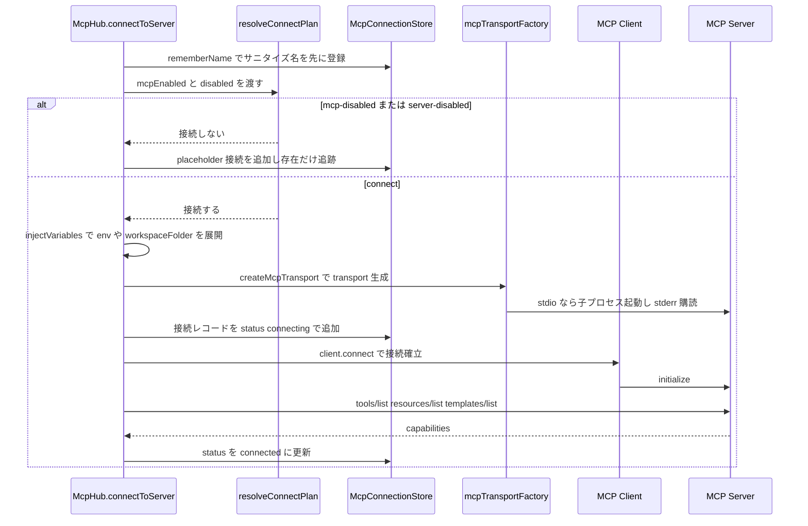
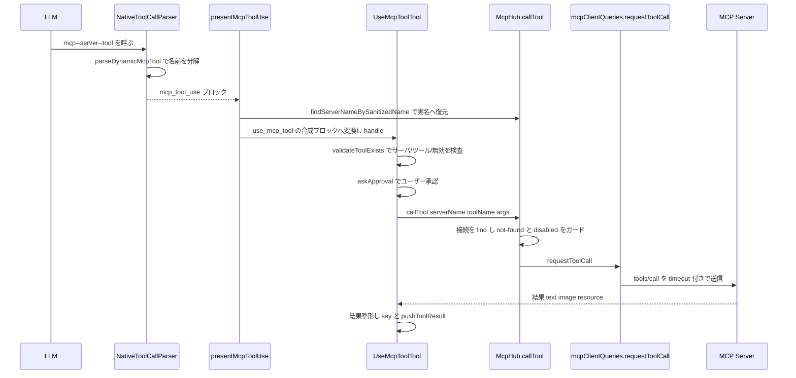

# MCP（Model Context Protocol）連携

MCP は、外部プロセスが公開する「ツール」と「リソース」を LLM に使わせるための標準プロトコルである。このエージェントでは、ユーザーが設定ファイルに書いた MCP サーバ（天気 API、DB クライアント、自前のスクリプトなど）を子プロセスまたは HTTP で起動・接続し、それらが公開するツールを **ネイティブのツール定義としてモデルに見せ**、モデルがツールを呼ぶと接続済みサーバへプロトコル要求を中継する。設定は「グローバル（全ワークスペース共通）」と「プロジェクト（`.agent/mcp.json`）」の 2 層で、ファイルを監視して変更を自動反映する。この文書は「何をする仕組みか・どう繋がるか・どこを読めばいいか」を追う。

主なコードは `src/services/mcp/`（接続の管理・プロトコル I/O）と、`src/core/`（モデルへの露出・ツール呼び出し・webview 連携）に分かれる。

---

## 登場人物と役割

各モジュールが「実際に何をするか」を一文ずつ:

- `src/services/mcp/McpServerManager.ts` — McpHub の **シングルトン番人**。複数の webview（provider）があっても MCP サーバ群は 1 セットだけ動くよう、`getInstance` が `initializationPromise` で多重初期化を防ぎ、provider を集合で追跡して（`unregisterProvider`）、`cleanup()` で明示破棄する。（接続ごとの参照カウント `registerClient`/`unregisterClient` で 0 になったら `dispose()` するのは McpHub 側の役割。）
- `src/services/mcp/McpHub.ts` — MCP サブシステムの **中枢（オーケストレータ）**。設定ファイルの読み込み・接続の張り直し・ツール呼び出しの受け口・webview への状態通知を束ねる。ただし判断ロジックと状態保持は下記の leaf モジュールへ委譲し、自身は「副作用の実行順序」を持つ。
- `src/services/mcp/McpConnectionStore.ts` — **接続集合の所有者**。接続配列と「サニタイズ名 → 実名」の対応表を持ち、`add`/`remove`/`find`/`withSource` のような意図の名前で操作させる（呼び出し側に生配列を触らせない）。問い合わせの中身は `mcpConnectionRegistry.ts` の純関数に委譲する。
- `src/services/mcp/McpConfigWatcher.ts` — **設定ファイル監視の配管**。グローバル設定・プロジェクト `.agent/mcp.json` の**ファイル変更を 500ms デバウンス**し、ワークスペースフォルダ変更は**即時**に「再取り込みせよ」と McpHub に伝えるだけ。実際の再取り込みはしない。
- `src/services/mcp/serverUpdatePlan.ts` — 「新しい設定」と「現在の接続」から **どのサーバを削除/接続/張り直すかを決める純関数**。副作用を持たず計画だけ返すので、fake 入力で網羅テストできる。
- `src/services/mcp/mcpClientQueries.ts` — 接続済みクライアントに対する **プロトコル I/O だけ**（tools/list・resources/list・tools/call・resources/read）。接続の解決や not-found/disabled のガードは持たない。
- `src/services/mcp/connectServer.ts` — 接続手続きの **判断と組み立ての純関数群**（接続ゲート判定・placeholder 生成・transport イベントハンドラ生成・失敗記録）。
- `src/services/mcp/mcpTransportFactory.ts` — 設定から実際の **transport を生成**する（stdio 子プロセス / SSE / streamable-http）。
- `src/services/mcp/serverConfigSchema.ts` — 設定の **zod スキーマと検証**。3 種の transport 型を判別し、失敗時は利用者向けの 1 文エラーにする。
- `src/services/mcp/ProgrammaticWriteGuard.ts` — **自分で書いた設定変更で再起動しない**ためのフラグ所有者（後述）。

---

## 接続ライフサイクル

### 設定ファイルの置き場所

2 層あり、**グローバルとプロジェクトで置き場所も「無いとき」の扱いも非対称**（`src/services/mcp/mcpSettingsFile.ts` の `resolveSettingsPath`）。

- **グローバル**: 拡張のグローバルストレージ内 `settings/mcp_settings.json`（`McpHub.getMcpSettingsFilePath` が解決。**無ければ空の雛形を作って返す**）。ブリーフにあった `.agent/mcp.json` はプロジェクト側の名前で、グローバルは `mcp_settings.json` である点に注意。
- **プロジェクト**: `<workspace>/.agent/mcp.json`（`getProjectMcpPath` が解決。**無ければ `null`** を返し、その層は単に存在しないものとして扱う）。

どちらのファイルも `{ "mcpServers": { "<名前>": { ... } } }` という形。サーバ設定は stdio 型（`command`/`args`/`env`/`cwd`）か url 型（`sse`/`streamable-http` + `url`/`headers`）で、全 transport 共通に `timeout`（既定 60 秒、1〜3600）・`disabled`・`alwaysAllow`・`disabledTools`・`watchPaths`（`BaseConfigSchema`）を持てる。`validateServerConfig` は stdio と url のフィールドが混在していないか等を先に判定し、zod の union エラーそのままではなく「どこが悪いか」の 1 文にして返す。

### 起動から接続まで

`McpServerManager.getInstance` が初回に `new McpHub(provider)` を作り、`waitUntilReady()`（グローバルとプロジェクトの初期接続試行が出揃うまで待つ。各サーバは個別にタイムアウトを持つので無限には待たない）を挟んでからインスタンスを確定する。McpHub のコンストラクタは、`McpConfigWatcher` を起動（`NODE_ENV=test` のときは実 watcher を張らない）し、グローバルとプロジェクトの初期化を**並行**で走らせる。

各サーバの接続は `McpHub.connectToServer` が担う。分岐判定は純関数に切り出されている:

要点:

- **サニタイズ名の登録は接続前**（`McpConnectionStore.rememberName`）。transport 生成に失敗しても、モデルが同じ名前で呼び直せるようにするため。
- 接続しない場合でも **placeholder 接続**（`createPlaceholderConnection`）を積んでサーバの存在を追跡する。`disabled` の見え方は理由で変わり、サーバ個別無効なら `true` 固定、MCP 全体無効なら設定値を保つ（全体を再有効化したとき元に戻すため）。
- transport 生成前に `injectVariables` で `${env:...}` などを展開するが、**store に載せる `server.config` は展開前の宣言**（`createConnectedConnection`）。この設定は webview へ丸ごと送られるため、展開後を載せるとシークレットが漏れる。展開後が必要なのは transport 生成だけで、どこにも保持しない。
- `mcpTransportFactory.createMcpTransport` は stdio の場合、stderr を接続処理中のエラーごと拾うために `client.connect()` より前に `transport.start()` を自前で呼び、二重起動を避けるため `start` を no-op に差し替える。Windows では `npx.ps1` 等を起動できるようコマンドを `cmd.exe /c` で包む。SSE は `ReconnectingEventSource` で自動再接続する。
- capabilities 取得（`refreshServerCapabilities` → `mcpClientQueries.fetchServerTools` ほか）では、`tools/list` の結果に**設定ファイル由来のフラグを載せる**（`mcpToolConfig.applyToolConfigFlags`）。`alwaysAllow`（自動承認）と `enabledForPrompt`（モデルに見せるか）はサーバ応答に含まれず、設定ファイルが正。

### 変更監視と差分計算

`McpConfigWatcher` はファイル変更を 500ms デバウンスして McpHub に通し、**拡張自身の書き込み中は無視**する（`ProgrammaticWriteGuard.isActive`）。プロジェクト設定ファイルの削除イベントは `handleProjectConfigDeleted` へ回し、そのソースのサーバを片付ける。

再取り込みは `McpHub.updateServerConnections` が受け、**判断は純関数 `serverUpdatePlan.planServerConnectionUpdates` に任せ、自身は副作用（切断・watcher・接続・通知）だけ**を実行する。計画は削除リスト `toDelete` と、各サーバへの操作 `actions`（`kind` は connect/reconnect/invalid の 3 種）からなる:

- `toDelete`: 新設定から消えたサーバ名（先に切断）。
- `connect`: 新規サーバ。
- `reconnect`: 既存だが**宣言（変数展開前）が変わった**サーバ。展開後で比較すると `${env:...}` を含む設定が毎回「変わった」と誤判定されるため、宣言同士を `deepEqual` で比べる（#250）。設定が同一の既存サーバは計画に含めず、何もしない。
- `invalid`: 検証に失敗した設定（エラー表示だけして他は進める）。

`ProgrammaticWriteGuard` の抑止時間は 600ms で、watcher のデバウンス 500ms を跨いで抑止し続ける。これにより、タイムアウト変更や `alwaysAllow` トグルなど**拡張自身の書き込み**では watcher が発火してもサーバが再起動しない。

このほか、ユーザー操作起点の `restartConnection`（設定を再検証して繋ぎ直す。UI 上で「再起動中」を見せるため 500ms の人工遅延を挟む）と、`refreshAllConnections`（全接続を破棄してグローバル・プロジェクトを 1 から再初期化。MCP 無効時は接続せず存在だけ追跡）がある。

---

## モデルへのツール露出とツール呼び出しの流れ

### ツールをモデルに見せる

MCP ツールは `use_mcp_tool` という 1 つの汎用ツールとしてではなく、**サーバ×ツールごとに個別のネイティブ関数**としてモデルへ渡る。`src/core/prompts/tools/native-tools/mcp_server.ts` の `getMcpServerTools` が、有効サーバ（`getServers`）の `enabledForPrompt !== false` なツールを走査し、`buildMcpToolName`（実体は `src/utils/mcp-name.ts`）で `mcp--<サーバ>--<ツール>` という関数名（サニタイズ済み・最大 64 文字）を作り、スキーマを 2020-12 準拠に正規化して関数定義にする。同名は先勝ちで重複排除（プロジェクトがグローバルより先）。

`src/core/task/build-tools.ts` の `buildNativeToolsArrayWithRestrictions` が、ネイティブツールと MCP ツールを結合してリクエストの `tools` 配列を組む。MCP 側は `filterMcpToolsForMode`（`src/core/prompts/tools/filter-tools-for-mode.ts`）を通り、**現在のモードで `use_mcp_tool` が許可されていなければ丸ごと空**になる。

### モデルの呼び出しが実行に至るまで

流れの要点:

- モデルが `mcp--server--tool` を呼ぶと、`src/core/assistant-message/NativeToolCallParser.ts` の `parseDynamicMcpTool` が名前を `serverName`/`toolName` に分解して `mcp_tool_use` ブロックにする。名前は `parseMcpToolName`（`src/utils/mcp-name.ts`）で分解し、モデルがハイフンをアンダースコアに書き換えても許容する。
- `src/core/assistant-message/presentMcpToolUse.ts` が、サニタイズ名を `McpHub.findServerNameBySanitizedName`（完全一致 → 登録済みサニタイズ名 → ハイフン/アンダースコア同一視のファジー一致）で**実名へ復元**し、`use_mcp_tool` の合成ブロックに変換して `UseMcpToolTool` に渡す。**手動の `use_mcp_tool` と同じ実行経路に合流**させつつ、API 履歴には元の関数名を残す。
- `src/core/tools/UseMcpToolTool.ts` の `validateToolExists` が、hub の `getAllServers` を使って **not-found / ツールなし / ツール未存在（ファジー一致）/ `enabledForPrompt === false` の無効ツール**を段階的にガードし、それぞれ利用可能なサーバ・ツール名を添えたエラーを返す。承認後 `callTool` を呼び、結果の `content`（text は連結、resource は blob を除いて JSON 化、image は data URL 化）を整形し、`mcpExecutionStatus` メッセージで webview に進捗（started/output/completed/error）を送る。
- `McpHub.callTool` は接続を `find` し、**接続が無い/未接続、または `disabled` を明示的にエラー**にしてから `mcpClientQueries.requestToolCall` に委譲する。`requestToolCall` は `server.config`（展開前宣言）から timeout を算出し（解析失敗時は 60 秒）、`tools/call` を送る。
- リソース側は `src/core/tools/accessMcpResourceTool.ts`（`server_name`/`uri` を検証 → 承認 → `McpHub.readResource` → `resources/read`）。同じく `readResource` が not-found/disabled をガードする。

---

## 有効ツール数の集計と system prompt 組込

`src/core/task/getEnabledMcpToolsCount.ts` は、`McpServerManager.getInstance` で hub を取り、`countEnabledMcpTools`（`packages/types/src/mcp.ts`）で「有効かつ接続済みのサーバ数と、その配下の有効ツール数」を数える。集計は `disabled` なサーバ・`status !== "connected"` なサーバを飛ばし、`enabledForPrompt !== false` のツールだけ数える。しきい値 `MAX_MCP_TOOLS_THRESHOLD`（60）を超えると UI が警告する（ツールが多すぎると LLM の選択精度が落ちるため）。

**`mcpEnabled` はフェイルオープン**である点が重要。`getEnabledMcpToolsCount` は `mcpEnabled ?? true`、`McpHub.isMcpEnabled` も provider 不在時や `state.mcpEnabled` 未定義時に `true` を返す。つまり**設定が未定義なら「有効」とみなす**。無効化されているのは、ユーザーが明示的に `mcpEnabled=false` にした場合だけ。

---

## 設定の webview 連携

`src/core/webview/mcpMessageHandlers.ts` が webview からの操作を hub へ振り分ける。hub は未初期化なら `undefined` を返すため、いずれもオプショナルチェーンで呼び（初期化前の操作を握り潰す）、失敗はログに残す。主なハンドラ:

- `openMcpSettings` / `openProjectMcpSettings` — グローバル/プロジェクトの設定ファイルをエディタで開く（プロジェクト側は無ければ `.agent/mcp.json` を作る）。
- `toggleMcpServer` — サーバの有効/無効を切り替える（`McpHub.toggleServerDisabled`）。状態遷移は `src/services/mcp/serverToggleAction.ts` の `resolveServerToggleAction` が判定し、稼働中を止める `reconnect-as-disabled` / 停止中を繋ぐ `reconnect-as-enabled` / 接続を保ったままツール一覧を取り直す `refresh-capabilities` / `none` の 4 択に分ける。
- `restartMcpServer` — 1 サーバを繋ぎ直す（`restartConnection`）。
- `refreshAllMcpServers` — 全サーバを再初期化（`refreshAllConnections`）。
- `deleteMcpServer` — 設定ファイルからサーバを削除して差分反映（`deleteServer`）。
- `updateMcpTimeout` — timeout を設定ファイルに書き戻す。
- `toggleToolAlwaysAllow` / `toggleToolEnabledForPrompt` — ツール単位の自動承認・プロンプト露出を設定ファイルの `alwaysAllow` / `disabledTools` に反映（`mcpToolConfig.toggleToolInList` は冪等）。

これらの書き込みはいずれも `ProgrammaticWriteGuard.run` で包まれ、watcher の再起動を誘発しない。hub → webview の逆方向は `McpHub.notifyWebviewOfServerChanges` が担い、サーバ一覧を**設定ファイルの記述順（プロジェクトが先、グローバルが後）**に並べて `mcpServers` メッセージで送る。

なお `src/services/mcp/mcpProviderRef.ts` は、mcp コードが ClineProvider から必要とする最小表面だけを定義した leaf インターフェースで、mcp ↔ webview の循環依存を断つために存在する（ClineProvider は構造的にこの型を満たすので、具象クラスを知らずに済む）。

---

## 拡張・変更の起点

- **新しい MCP サーバを足す** — コード変更は不要。設定ファイル（グローバル `mcp_settings.json` / プロジェクト `.agent/mcp.json`）の `mcpServers` に stdio か url のエントリを追記するだけ。webview の MCP 設定画面からも編集できる。
- **transport を増やす** — `serverConfigSchema.ts` にスキーマを足し、`mcpTransportFactory.ts` に生成分岐を追加。
- **接続の張り直し条件を変える** — 差分計算は純関数 `serverUpdatePlan.planServerConnectionUpdates` に集約。副作用は `McpHub.updateServerConnections`。
- **モデルへの露出を変える**（関数名・スキーマ整形）— `src/core/prompts/tools/native-tools/mcp_server.ts` の `getMcpServerTools` と `src/utils/mcp-name.ts` の `buildMcpToolName`。

## 既知の注意

- **`mcpEnabled` はフェイルオープン**（未定義＝有効）。無効化は明示的 `false` のときだけ。
- ツール数が `MAX_MCP_TOOLS_THRESHOLD`（60）を超えるとモデルの選択精度が落ちるため UI が警告する。
- `server.config` は**変数展開前の宣言**を保持する（webview へ丸ごと送られるため、展開後を載せるとシークレットが漏れる）。

## 読みどころの早見表

| 知りたいこと                        | 最初に読むファイル                                                                     |
| ----------------------------------- | -------------------------------------------------------------------------------------- |
| 全体のオーケストレーション          | `src/services/mcp/McpHub.ts`                                                           |
| 接続前の分岐・placeholder・失敗記録 | `src/services/mcp/connectServer.ts`                                                    |
| 差分計算（削除/接続/張り直し）      | `src/services/mcp/serverUpdatePlan.ts`                                                 |
| プロトコル I/O（tools/call など）   | `src/services/mcp/mcpClientQueries.ts`                                                 |
| transport 生成（stdio/sse/http）    | `src/services/mcp/mcpTransportFactory.ts`                                              |
| 設定スキーマと検証                  | `src/services/mcp/serverConfigSchema.ts`                                               |
| ファイル監視とデバウンス            | `src/services/mcp/McpConfigWatcher.ts`                                                 |
| 接続集合・名前解決                  | `src/services/mcp/McpConnectionStore.ts` / `mcpConnectionRegistry.ts`                  |
| モデルへのツール露出                | `src/core/prompts/tools/native-tools/mcp_server.ts` / `src/core/task/build-tools.ts`   |
| モデル呼び出しの実行合流            | `src/core/assistant-message/presentMcpToolUse.ts` / `src/core/tools/UseMcpToolTool.ts` |
| 有効ツール数の集計                  | `src/core/task/getEnabledMcpToolsCount.ts`                                             |
| webview からの設定操作              | `src/core/webview/mcpMessageHandlers.ts`                                               |
